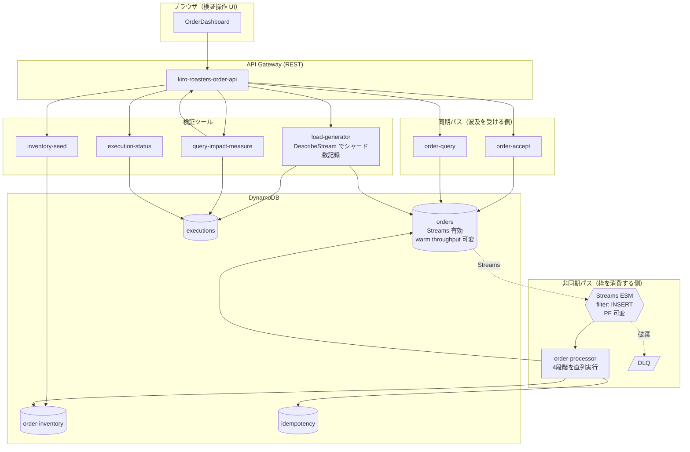
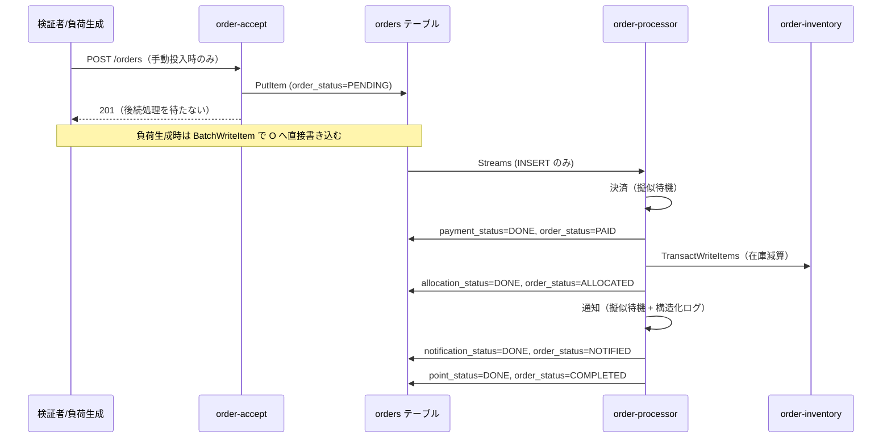

# 設計: EC 注文処理パイプライン PoC（ベース + Streams 直結構成）

## Overview

要件定義（`requirements.md`）で定めたベース基盤と `direct` パイプラインの設計。

本設計の目的は、**DynamoDB Streams と Lambda を直結したときの限界がどこに来るか**を
実測できる装置を作ることである。したがって設計の中心は機能ではなく、
**壁の候補を洗い出し、それぞれが壁になる条件を式で表し、変数を1つずつ動かせるようにすること**にある。

事前分析の結論は「壁は Lambda の同時実行枠ではなくシャード数である」だが、
これは仮説であり、装置はこの仮説を**反証できる**形にする。

> **🟢 実測（軸 A: A0〜A8 / 軸 B: B0〜B2。2026-08-29〜30）: 仮説は支持された。**
> **壁は `S × P ÷ D`（× 0.84）にあり、S を 4 → 64 に増やすと壁の位置ごと約 15.6 倍動いた。**
> 同時実行枠は**軸 A（12.4%）でも軸 B（飽和時でも 72.1%）でも壁にならなかった。**
> **ただし「同時実行枠が壁になる領域」には到達していない。**
> 到達には warm write 100,000（B3 / B4）が必要で、us-west-2 のクォータ上限を超えるため
> 実行できていない（§13 の #7）。**支持されたのは前半（シャード数が壁である）だけで、
> 後半（同時実行枠は壁ではない）は「今回の到達範囲では壁にならなかった」までである。**
> 想定と実測の対比は各節に併記し、上書きしていない。
> 出典: `docs/poc/verification-results.md`。

人為的に現象を起こす仕組み（ダミー関数による同時実行枠の予約など）は採用しない。
壁は、シャード数という実在の変数を動かして自然に到達させる。

---

## Architecture

### 1.1 全体構成



全ての Lambda は予約枠を持たず、アカウントの未予約プールを共有する。
これは意図的である。**枠の奪い合いが起きるかどうかを観測するために、
枠を人為的に区切らない。**

### 1.2 注文の流れ



---

## 2. 限界の構造（本設計の核心）

### 2.1 消費能力の式

DynamoDB Streams のオープンシャードはテーブルのパーティションと 1 対 1 で対応し、
Lambda は 1 つのオープンシャードを 1 つの関数インスタンスで処理する。
`ParallelizationFactor`（PF、既定 1・最大 10）がシャードあたりの並行バッチ数を増やす。

出典: [Change data capture for DynamoDB Streams](https://docs.aws.amazon.com/amazondynamodb/latest/developerguide/Streams.html) /
[Lambda parameters for Amazon DynamoDB event source mappings](https://docs.aws.amazon.com/lambda/latest/dg/services-ddb-params.html)
（ライセンス上の制約に配慮して内容を要約した）

```
最大同時実行数 = オープンシャード数(S) × PF(P)
消費能力       = S × P ÷ 1レコードの処理時間(D)
```

> **🔴 実測: この式は P について線形ではない。**P = 1 では −0.2% で一致するが、
> **P = 10 では実測が式の 0.84〜0.85 倍にとどまる。**
> `ParallelizationFactor` を使う条件では `S × P ÷ D × 0.84` を使う（§2.2 の 7'）。

`BatchSize` はこの式に現れない。バッチ内を直列処理する限り、
`S × P × BatchSize ÷ (BatchSize × D)` は `BatchSize` で約分される。
`BatchSize` が変えるのは 1 呼び出しの長さとタイムアウトの余裕だけである。
この性質自体を検証記録に含める。

### 2.2 壁の候補と、それぞれが壁になる条件

本 PoC の構成で限界になり得る要素を網羅する。**この表が本 Spec の主要な成果物**であり、
「必要到達レート」列は実測で検証・修正する。

**S と D は実測で確定した（タスク 14。§13 の #1 / #2）。** 想定と実測を併記して、
どの数字がどちらに基づくかを後から追えるようにする。

| 記号 | 想定（設計時） | 実測 | 確定方法 |
|------|-------------|------|---------|
| S（オープンシャード数） | 4（新規オンデマンドテーブルの初期容量 4,000 WCU から推定） | **4** | `DescribeStream`（総シャード 4 / オープン 4） |
| P（`ParallelizationFactor`） | 1 または 10 | 1（計測時の設定値） | 環境変数 |
| D（1 レコードの処理時間） | 3.6 秒（擬似待機 3.5 秒 + オーバーヘッド 100ms） | **3.65 秒**（ウォーム時の Lambda `Duration` = 3,652.57ms） | EMF `StageDurationMs` と Lambda `Duration` |

**D はハンドラの `Duration` を採る。** シャードの並行枠を占有するのは
段階の合計ではなく呼び出し全体だからである。

| 段階 | 平均(ms) | 最小 | 最大 | 擬似待機 | オーバーヘッド |
|------|--------:|-----:|-----:|--------:|------------:|
| `payment` | 3,028.76 | 3,016 | 3,073 | 3,000 | 28.76 |
| `allocation` | 45.40 | 33 | 104 | — | 45.40 |
| `notification` | 528.92 | 516 | 579 | 500 | 28.92 |
| `point` | 35.36 | 16 | 79 | — | 35.36 |
| **4 段階の合計** | **3,638.44** | | | 3,500 | **138.44** |
| Lambda `Duration` | **3,652.57** | 3,597.02 | 3,788.48 | 3,500 | **152.57** |

段階外のハンドラ処理は `Duration` − 段階合計 = **14.13ms**
（冪等性コンテキストの登録、設定解決、メトリクスのフラッシュ、Streams レコードのアンマーシャル）。
擬似待機 3,500ms に対するオーバーヘッドの合計は **152.57ms**（想定は 100ms）。

計測条件（この D を後から再導出できるように残す）:

| 項目 | 値 |
|------|-----|
| 実行日 | 2026-08-29 |
| 環境 | サンドボックス `us-west-2` / アカウント `992382598974` |
| 関数 | `kiro-order-processor-2fe83132` |
| ESM | `BatchSize = 1` / `ParallelizationFactor = 1` |
| 擬似待機 | 決済 3,000ms + 通知 500ms = 3,500ms |
| テーブル | warm throughput 未設定（`PAY_PER_REQUEST`、既定 write 4,000 / read 12,000 units/s） |
| 投入 | 30 件を 16 秒かけて逐次投入（別途タスク 13 の 2 件） |
| 標本 | **ウォーム 25 件のみ**（コールドスタート 5 件を除外） |

コールドは 4 段階合計 4,053.00ms、`Duration` 4,097.84ms、`Init Duration` 368.34ms
（`Init Duration` は `Duration` に含まれない）で、実時間の追加は約 814ms。
定常状態の消費能力の基礎にはウォームを使う。
タスク 13 の 2 件は両方コールドで、段階合計 約 3,968ms（ウォーム 3,638ms）と
D を約 400ms 過大に見せるため使わない。

以下は S = 4、D = 3.652 秒、1 注文 1 KB として計算した値。

| # | 壁の候補 | 上限 | 到達に必要な投入レート | 軸 A で壁になるか |
|---|---------|------|---------------------|-----------------|
| 1 | API Gateway アカウント上限 | 10,000 req/s | 600,000/分 | ならない。負荷生成は API を経由しない |
| 2 | `order-accept` の同時実行 | 未予約プール | 30ms × レート。267/s で約 8 同時実行 | ならない |
| 3 | DynamoDB 書き込み（新規オンデマンドの即時容量） | 4,000 WCU | 240,000/分 | ならない |
| 4 | DynamoDB パーティション単位の書き込み | 1,000 WCU/パーティション | — | ならない。PK が ULID で分散する |
| 5 | Streams の発行 | テーブル書き込みに追随して自動スケール | — | **ならない**（問い 1 への答え） |
| 6 | Streams のシャード読み取り | `GetRecords` 1 MB / 1,000 レコード。同一シャードの読み手は 2 まで | — | ならない。ESM がポーリングを管理する |
| 7 | **Streams の消費能力 `S × P ÷ D`** | S=4, P=1 → **65.7/分**（想定 67）<br/>S=4, P=10 → **657/分**（想定 667） | **65.7/分 または 657/分**<br/>**実測: P=1 は 66.30/分（式どおり、−0.2%）。P=10 は 557.5〜569.6/分＝式の 0.84〜0.85 倍**（下記「P について線形にスケールしない」） | **なる。軸 A の壁** |
| **7'** | **`ParallelizationFactor` 内部のチェックポイント同期**<br/>**（設計時に候補として挙げていなかった要素）** | 想定: なし（`S × P` の枠は飽和すれば埋まると考えていた）<br/>**実測: 枠の稼働率が 83.7〜85.8% で天井を打つ** | **557.5/分**（PF=10 の保守値。式の 663〜666/分 ではない） | **なる。P=10 のときだけ現れる。**P=1 では稼働率 99.8% で現れない（下記） |
| 8 | Lambda 同時実行枠 | 1,000 | `S × P ≥ 1,000` が必要。P=10 なら **S ≥ 100**<br/>**実測: warm write 40,000 で S = 64・`S × P` = 640。飽和時でも照会 81 を足して 721 / 1,000 = 72.1% で届かない**（§2.6） | **ならない**（問い 2 への答え）。~~軸 B でなる~~ **軸 B でもならなかった。**到達には B3 / B4 が必要だが実行不可 |
| 9 | Lambda の同時実行スケーリングレート | 関数あたり 10 秒で 1,000 | 立ち上がりが急な場合 | ~~可能性あり。観測対象とする~~ **観測できなかった。**同時実行枠に到達しないため立ち上がりを観測する機会が無い（§13 の #7） |
| 10 | **Streams の保持期限** | 24 時間 | `IteratorAge` = 24h、すなわち 滞留 > 24h × **投入レート**（§2.4 の訂正） | **なる。データロスとして現れる** |
| **11** | **GSI `customer-orders-index` の読み取り容量**<br/>**（設計時に候補として挙げていなかった要素）** | オンデマンドの即時読み取り容量 **12,000 RCU/s** | 照会 60 並行（実測 1,531.8 req/s）で **2,410.7 RCU/s = 20.1%**。**照会並行数を約 5 倍にすると飽和する** | **ならなかった**（A8 で `ReadThrottleEvents` = 0）。**ただし軸 A で最も薄い余裕である**（下記） |

**D に依存するのは #7 だけである。** 実測反映で数字が動いたのも #7 のみ。
（**後から加わった 7' も D を通して効くが、効き方は「#7 に係数 0.84 を掛ける」形であり、
係数そのものは D に依存しない。**実測で D を 5.16 分の 1 にしても 0.84 は動かなかった。下記。）
#2 は `order-accept`（同期パス）の処理時間で決まり D を含まない。
#3 / #4 は WCU、#8 は `S × P`、#10 は「24h × 投入レート」という式のままで、
いずれも D の実測値で書き換わらない。
（#10 の分子は当初「24h × 消費能力」と書いていた。§2.4 の訂正に合わせて
投入レートに直した。D とは無関係の訂正である。）

**壁の位置は想定から約 2% しか動かなかった（67 → 65.7、667 → 657）。**
D の想定 3.6 秒に対して実測 3.652 秒、誤差 1.4% である。
「擬似待機以外のオーバーヘッドが D を大きく膨らませて壁の位置をずらす」という
§13 #2 の懸念は**外れた**。これ自体が記録すべき所見である。
擬似待機が支配的な処理では、擬似待機の設定値 + 概算オーバーヘッドで
壁の位置を実用的な精度で予測できる。

**軸 A で壁になるのは #7 と #10 のみ（設計時の判定）。** 他の 8 個は壁にならない。
「壁にならないこと」を実測で示すのも成果である（成功基準 3）。

> **🔴 実測による訂正（軸 A 完了時点）。** 壁になったのは **#7 と 7'** である。
> #10（保持期限）は軸 A のどのシナリオでも到達しなかった（外挿では 33.6〜53.4 時間の連続投入が必要）。
> **7' は設計時にこの表に無かった要素であり、「網羅した」という本節の主張が
> 実測で 1 つ破れたことになる。**これ自体が記録すべき所見である。
> **#11（GSI の読み取り容量）は壁にならなかったが、軸 A で最も薄い余裕を作った**
> （20.1%。Lambda 同時実行枠の 12.4% / DynamoDB 書き込みの 1.43% より桁が 1 つ上）。
> 出典: `docs/poc/verification-results.md` の §2.5 / §2.7。

`S × P` が同時実行の上限を作るため、`direct` 構成は**意図せず流量制御されている**状態でもある。
出典 FR-2.5（決済の流量制御）は実現手段を持たないが、
結果として決済の並行数は 40（S = 4 実測 × P = 10）に抑えられている。
S が実測で確定したため、この 40 は推定値ではなく確定値である。これは検証で確認する。

> **🔴 実測による訂正: 「並行数 40」と「40 req/s」は別物である**（A8。出典 §4）。
> **FR-2.5 の上限は 50 req/s であり、比較すべきは並行数ではなく呼び出しレート
> `S × P ÷ D` である。**
>
> | 量 | 算術 | 値 | 50 req/s に対して |
> |----|------|-----|-----------------|
> | 理論値 | `40 並行 ÷ 3.6 秒` | **11.1 req/s** | 22.2% |
> | **実測値** | 処理レート 547.7/分 ÷ 60（注文 1 件 = 決済 1 回） | **9.13 req/s** | **18.3%。収まった** |
>
> **収まった理由は「並行数が 40 だから」ではなく「D が 3.6 秒と大きいから」である。**
> 境界は `40 ÷ D = 50` すなわち **D = 0.8 秒**であり、
> **D = 0.6 秒（A6 の擬似待機に相当）では同じ 40 並行が 66.7 req/s = 上限の 133% になり
> FR-2.5 は破れる。**
> **速い依存先ほど意図せぬ流量制御が外れる。**これは「上限が `S` に依存し、`S` は
> テーブルの成熟度で勝手に変わる」（§2.5 / 軸 B）に次ぐ **2 つ目の理由**であり、
> **この副作用を設計上の流量制御機構として頼ってはならない。**
>
> **🔴 実測（B1 / B2）: 1 つ目の理由（`S` 依存）も実測で裏づけられた。
> 本設計の警告どおり、軸 B は意図せぬ流量制御を壊した。**
> 本節は「上限が `S` に依存するため頼れない」と警告していたが、これは推論だった。
> **軸 B が S = 64 を実測したことで、破れる側の数値が確定した。**
>
> | 量 | **軸 A（S = 4）** | **軸 B（S = 64。実測）** |
> |----|----------------:|----------------------:|
> | `S × P` | 40 | **640** |
> | 決済の呼び出しレート（**飽和時**。`S × P ÷ D × 0.84`） | **9.13 req/s**（実測） | **147.2 req/s**（`640 ÷ 3.65 × 0.84`） |
> | FR-2.5 の上限 50 req/s に対して | **18.3%。収まる** | **294%。🔴 破る** |
> | B2 の運転点での実測 | — | **33.25 req/s**（上限の 66.5%） |
>
> **B2 が 33.25 req/s で収まったのは投入が 2,000 件/分（比 0.226）だったからであり、
> `S × P` が抑えてくれたからではない。** 飽和すれば 147.2 req/s に達する。
> **上限 50 req/s を割る境界は `50 × 3.65 ÷ 10 ÷ 0.84` = S ≈ 21.7、
> すなわち warm write 約 22,000 相当**である。本 PoC が設定した 40,000 はこれを超えている。
>
> **FR-2.5 の「意図せぬ流量制御」には、独立に実測された破れ方が 2 つある。**
>
> | # | 軸 | 破れる条件 | 境界 | 実測の出所 |
> |---|----|----------|------|----------|
> | 1 | **D（依存先の速さ）** | 依存先が速くなると同じ並行数でレートが上がる | **D = 0.8 秒** | A8 / A6（D = 0.6 秒で 66.7 req/s = 133%） |
> | 2 | **S（テーブルの成熟度）** | ウォームやデータ成熟で S が増えると並行数ごと上がる | **S ≈ 21.7（warm write 約 22,000）** | **B1 / B2（S = 64 → 147.2 req/s = 294%）** |
>
> **どちらも「構成を変えていないのに勝手に外れる」形の破れ方である。**
> 依存先の高速化もテーブルの成熟も、パイプラインの設定変更を伴わない。
> **流量制御が必要なら明示的な機構（Phase 2 の SQS ファンアウトとワーカー単位の
> 同時実行数上限）を置くしかない。**
> 出典: `docs/poc/verification-results.md` の §4。

#### 🔴 実測による訂正: `S × P ÷ D` は P について線形にスケールしない（7'）

**本設計で最も大きな訂正である。**
`S × P ÷ D` は **P = 1 では正しく、P = 10 では能力を約 19% 過大に見せる。**
D の実測反映（壁が 2% 動いた）とは桁が違う。想定と実測を併記して経緯を残す。

| P | 式による能力（想定） | 実測 | **実測 ÷ 式** | 枠 `S × P` の稼働率 |
|--:|------------------:|-----:|-----------:|------------------:|
| 1 | 66.4/分（D = 3,613ms） | **66.30/分**（A2） | **99.8%（−0.2%）** | **99.8%** |
| 10 | 666.3/分（D = 3,602ms） | **557.5/分**（A7。滞留 6,697 件） | **83.7%** | **83.7%** |
| 10 | 665.8/分（D = 3,604.9ms） | **569.6/分**（A5。滞留 約 43,000 件） | **85.5%** | **85.8%** |
| 10 | 3,439.9/分（**D = 697.7ms**） | **2,889.6/分**（A5 の滞留を新しい D で消化） | **84.0%** | **84.0%** |

**PF=10 の壁の位置は単一値ではなく帯で書く: 557.5〜569.6/分。保守側は 557.5/分。**
3 実行（A4 / A5 / A7）が 2.2% の幅に収束した。**係数は 0.84〜0.85 である。**
**PF=1 の壁の位置（66.30/分。式どおり）は訂正しない。誤っているのは P 倍の外挿だけである。**

**この損失は「待ち行列が足りないから」ではない。構造的である。**
A1 で観測された 428ms の損失（稼働率 89.4%）は待ち行列を積んだら 7ms に消えた（A2）。
**7' は消えない。滞留を 6.4 倍（6,697 → 約 43,000 件）にしても稼働率は
83.7% → 85.8% の 2 ポイントしか動かず、1 レコードあたり 600〜700ms の
オーバーヘッドが残り続ける。**投入や滞留を増やして越えられる天井ではない。
**A1 の 428ms とは別の機構である。**

**機構（§2.1 の読み替え）。** `ParallelizationFactor` は 1 シャードを
`order_id` のハッシュで P 本の並行バッチに分けるが、**ESM はシャード内の
チェックポイントの順序を保つため、各シャードで進行を揃える。**
P 本のうち最も遅い呼び出しが次の一巡を律速するため、
呼び出し時間のばらつきがそのまま待ち時間として乗る。
**P = 1 には揃える相手がいない。だから係数が 1.0 になる。**

**係数 0.84 は D に依存しない（実務上重要）。**

```
D は             3,602 → 697.7ms      ÷ 5.163
オーバーヘッドは    703 →   132.9ms    ÷ 5.291   ← ほぼ同じ倍率
オーバーヘッド ÷ D  0.195 → 0.190       差 2.5%   ← 不変
比               0.837〜0.855 → 0.8400            ← 動かない
```

競合仮説（オーバーヘッドは一巡あたり固定費）は D = 697.7ms で **1,713/分** を予測したが、
**実測は 2,889.6/分（予測の 1.69 倍）で、この仮説は決定的に否定された。**
**したがって `S × P ÷ D × 0.84` は D の全レンジで使える**
（実証範囲は 697.7〜3,602ms の 5.2 倍の幅）。
**擬似待機を削って D を短くすれば能力は D に反比例してそのまま伸び、
短い D で「同期コストの固定費に食われる」劣化は起きない。**
機構の説明（D に比例するばらつき）と実測が一致したことでもある。

**測ったことの限界を明記する。**

- **P は 1 と 10 の 2 点しかない。**0.84 が P について一定なのか、
  P とともに悪化するのかは**本 PoC では決まらない。**
- **中間の P（2 / 5）を測るシナリオは本 Spec に存在しない**（§10.2）。
- **S 側で同じ損失が出るかは未検証である。**軸 B（B0〜B4）が S を増やして
  P = 10 に保つため、そこで答えが出る（§13 の #9）。
  **🔴 実測: 答えは出なかった。**軸 B は S = 64 を実現したが、
  **実行できた B2 の投入 ÷ 能力が 0.226 で飽和しなかったため能力の絶対値を測れていない。**
  飽和させる B3 / B4 は実行不可である（§13 の #9 / #7）。
  **したがって 0.84 は P = 10・S = 4 の条件でのみ実測された係数である。**

出典: `docs/poc/verification-results.md` の §2.2。

#### 実測による補足: オーバーヘッド 152.57ms は固定費ではなく分解できる

**D の予測を擬似待機 + 固定オーバーヘッドで行うと、擬似待機を大きく変えたときに外れる。**

| 条件 | 予測 D | 実測 D | 乖離 |
|------|------:|------:|-----:|
| 決済 3,000ms + 通知 500ms | 3,600ms（3,500 + 100） | **3,652.57ms** | +1.4% |
| **決済 100ms + 通知 500ms** | **752ms**（600 + 152.57） | **697.7ms** | **−7.2%** |

**152.57ms のうち一部は擬似待機に比例する成分だった。**
タスク 14 の内訳では決済 3,000ms に **+28.76ms**、通知 500ms に **+28.92ms** が乗っており、
決済を 100ms にするとこの比例成分が消える。実測 697.7ms は「600ms + 約 98ms」であり、
**固定成分は約 98ms、擬似待機に比例する成分が約 55ms だったと読める。**

**より正確な模型: オーバーヘッド ≒ 固定 約 100ms + 擬似待機の約 1%。**

**`ASSUMED_STAGE_OVERHEAD_MS` = 100 は変更しない。**
この 100 は**固定成分の良い値である**ことが実測で裏づけられた（約 98ms）。
定数を動かすと `GET /config` の応答と実行レコードの
`estimated_capacity_per_minute` が変わるため、据え置く（§10.1 / 論点 10）。
**過小になるのは擬似待機が長い条件だけである**（決済 3,000ms で 52.57ms ぶん、D の 1.4%）。
**逆に擬似待機が短い条件では過大になる**（決済 100ms では実測 697.7 に対し
`ASSUMED` の見積もりは 3,428.57/分 = 実測 2,889.6/分 の 1.19 倍。
ただしこの差の主因は 7' のスケール損失であり、オーバーヘッドの寄与は小さい）。

### 2.3 連鎖の順序

限界は段階的に現れる（問い 3 への答え）。

| 段階 | 何が起きるか | 発生条件 | 気づけるか |
|-----|------------|---------|-----------|
| 0 | 受付・照会は無傷。スロットルはゼロ | 全域 | — |
| 1 | 滞留が線形に増加し始める | 投入 > 消費能力 | `IteratorAge` を見ていれば気づける |
| 2 | 後続処理の遅延が業務 SLA を超える | 滞留の蓄積 | 顧客からの問い合わせで気づく |
| 3 | **保持期限でレコードがトリムされデータロス** | `IteratorAge` = 24h（滞留 > 24h × **投入レート**）。A ÷ C = 3 なら約 36 時間の連続投入（§2.4 の訂正） | **監視していないと気づかない** |
| 4 | 投入停止後も滞留が残り、回復に時間がかかる | — | — |

**段階 0 が重要である。** 受付 API と照会 API は最後まで無傷のままで、
非同期側だけが静かに壊れる。エラー率も上がらず、レイテンシも悪化しない。
`IteratorAge` を監視していなければ、データを失うまで誰も気づかない。

これが `direct` 構成の実際の壊れ方であり、
出典が想定していた「巻き添えスロットル」とは異なる。

### 2.4 滞留の算術

観測と予測に使う式を導出する。

> **🔴 本節の式は A2 の実測で訂正した（2 回目の更新）。**
> 当初は `IteratorAge = B ÷ C` を出発点にしており、**分母が誤っていた**。
> 正しくは `IteratorAge = B ÷ A`（投入レート）である。
> §2.2 の D と同じく、当初の式と訂正後の式を併記して経緯を残す
> （末尾の「訂正の記録」）。出典は `docs/poc/verification-results.md` の §2.4。

**滞留件数と `IteratorAge` の関係**

`IteratorAge` は「最も古い未処理レコードがストリームに書かれてからの経過時間」である。
**「滞留 B を消費能力 C で消化するのに要する時間」ではない。** 前者を後者と読み替えたのが
当初の誤りであった。

いま処理している先頭レコードは `IteratorAge` 前に書かれたものである。
その時刻から現在までに投入レート A で `A × IteratorAge` 件が書かれ、
先頭がまだ未処理である以上、それらもすべて未処理のまま積み上がっている。

```
B = IteratorAge × A          （したがって IteratorAge = B ÷ A）
```

**分母は投入レート A である。消費能力 C ではない。**

**滞留の増加率**

```
dB/dt = 投入レート(A) − 消費能力(C)
```

**`IteratorAge` の増加速度（無次元）**

```
d(IteratorAge)/dt = (dB/dt) ÷ A = (A − C) ÷ A = 1 − C ÷ A
```

投入が消費能力の 3 倍なら `1 − 1/3 = 0.667`。
`IteratorAge` は実時間 1 秒あたり 0.67 秒ずつ増える。

**この値は必ず `[0, 1)` に入る。式の健全性はこれで確かめられる。**
`IteratorAge` は経過時間であり、実時間 1 秒あたり 1 秒より速く古くなることは
原理的にありえない。`C → 0`（消費が完全に停止）で上限 1 に漸近し、
そのとき滞留の先頭は実時間と 1:1 で古くなる。
当初の式 `A ÷ C − 1` は A = 3C で 2 を返し、上に有界でない。
**この 1 点で、実測を待たずに誤りと判定できる形になっていた。**

**データロスまでの猶予時間**

`IteratorAge` が保持期限（24 時間 = 86,400 秒）に達した時点でトリムが始まる。

```
T_loss = 86,400 ÷ (1 − C ÷ A)   [秒]
```

A = 2,000/分、C = 657/分（実測 D による。§2.2）のとき
`C ÷ A = 0.329`、`1 − C ÷ A = 0.672` なので `T_loss ≒ 128,700 秒 ≒ 35.7 時間`。
**消費能力の約 3 倍のバズが約 36 時間続くとデータを失い始める。**

> **🔴 この数値例の `C` は式の値（657/分）であり、PF=10 の実測能力ではない。**
> **実測の飽和能力 557.5/分 を入れると `1 − C ÷ A = 0.721`、
> `T_loss ≒ 119,800 秒 ≒ 33.3 時間` になり、猶予は約 2.4 時間短くなる。**
> **式の形は訂正不要で、代入する `C` の取り方の問題である。**
> 上の数値例は §2.2 の 7'（スケール損失 0.84）を反映する前に書いたものであり、
> **経緯の記録として残す。実務では `C = S × P ÷ D × 0.84` を代入する。**
> 結論（1 日を超える連続バズでなければデータを失わない）は変わらない。
> 軸 A の実測からの外挿では **33.6〜53.4 時間**の連続投入が必要という帯になる
> （`docs/poc/verification-results.md` の §2.5）。

（想定 D = 3.6 秒・C = 667/分 では `1 − C ÷ A = 0.667`、
`T_loss = 129,600 秒 = 36 時間` になる。
D の実測反映で猶予は約 15 分短くなるだけで、結論は変わらない。）

**猶予は当初の記述より `A ÷ C` 倍長い**（3.044 倍。11.7 時間 → 35.7 時間）。
誤りの向きは保守側だったが、数値としては誤りである。
正しい結論は「1 日を超える連続バズでなければデータを失わない」であって、
「半日で失い始める」ではない。対処の猶予の見積もりが 3 倍変わる。

**回復時間**

投入を止めた後、滞留は消費能力で消化される。

```
T_recover = B ÷ C = 停止時点の IteratorAge × A ÷ C
```

**回復時間は停止時点の `IteratorAge` に等しくない。`A ÷ C` を掛ける。**
当初は「追加の計算を要さずグラフから直接読める」と書いていたが、
それが成り立つのは A = C のときだけである。
ただし投入レート A は負荷生成の実行レコードに記録されている（論点 10）ため、
**掛ける値は常に手元にあり、算出そのものは容易である。**
`IteratorAge` のグラフを 1 つ読めば済む、という利点だけが失われる。

> **実測による注記 1: `C` には消化末尾の減衰を含めた実効レートを使う**（A7。式の形は訂正不要）。
> **4 本のシャードは同時に空にならない。**先に空いたシャードの枠が遊ぶため、
> 消化の末尾では実効的な並行度が `S × P` を下回り、レートが落ちる
> （A7 では 557.5/分 が 391 → 152 → 14 件/分 へ）。
>
> | `C` の取り方 | A7 の予測 | 実測 13.42 分に対して |
> |------------|--------:|-------------------:|
> | 飽和能力 557.5/分 | 11.72 分 | 87.3%（**約 11% 短く出る**） |
> | **減衰を含む実効レート 499/分（飽和能力の 0.895 倍）** | **13.09 分** | **97.5%（誤差 2.5%）** |
>
> **保守的に見るなら `C` に飽和能力の約 0.9 倍を入れる。**
> **この 0.9 の重みは滞留が大きいほど 1 に近づく**（減衰区間が全体に占める割合が
> 下がるため。A7 の滞留 6,697 件では減衰区間が消化の 15%、A5 の約 43,000 件では約 2.6%）。
>
> **実測による注記 2: 傾きの式は `S` / `P` / `D` の構成に依存しない**（A2 と A5）。
> `d(IteratorAge)/dt = 1 − C ÷ A` に `P` は現れない。**`P` は `C` を通してしか効かない。**
> A2（P=1、比 3.01、誤差 **+0.9%**）と A5（P=10、比 3.58、誤差 **−0.9%**）の
> 両方が一致したことで、構成に依存しないことを実測で確かめた。

これらの式は実測で検証する（要件 20.8）。乖離があればその要因を記録する。

**訂正の記録（当初の式と A2 の実測）**

| 量 | 当初の式（誤り） | 訂正後の式 | A2 の実測（`verification-results.md` §2.4） |
|----|--------------|----------|------------------------------------|
| 滞留件数 | `B = IteratorAge × C` → 661 件 | `B = IteratorAge × A` → 1,987 件 | 直接計測 **2,002 件**（訂正後の式と誤差 −0.7%） |
| `IteratorAge` の増加速度 | `A ÷ C − 1` → 2.008 | `1 − C ÷ A` → 0.668 | **0.673**（訂正後の式と誤差 0.9%） |
| 回復時間 | 停止時点の `IteratorAge` → 9.97 分 | `停止時点の IteratorAge × A ÷ C` → 30.0 分 | **30.2 分**（外挿。当初の式の 3.02 倍で、比は `A ÷ C` = 3.008 と一致） |
| データロス猶予 | `86,400 ÷ (A ÷ C − 1)` → 11.9 時間 | `86,400 ÷ (1 − C ÷ A)` → 36.0 時間 | 実測の傾き 0.673 から **35.7 時間**（訂正後の式と誤差 0.8%） |

A2 の条件は A = 199.4/分（実測）、C = 66.30/分（投入停止後の消化レートの実測）、
停止時点の `IteratorAge` = 598 秒。

**A1 では誤りが露出しなかった。** 両式は A = C でのみ一致し（どちらも 0 を返す）、
A1 の投入比は 0.91 でその近傍にいた。**A1 の記録は訂正不要である**
（`A(1 − 傾き)` と `A ÷ (1 + 傾き)` は傾きが小さいとき一致する）。
比が 1 から離れるシナリオ（A2 以降）で初めて 3 倍の差として現れた。

**訂正の波及先。** §2.2 の #10（保持期限の到達条件）、§2.3 の段階 3、
§10.2 の A7 の意図、論点 9（滞留件数の導出）、§13 の #8、
および `src/lib/orders/capacity.ts` を併せて訂正した。
**§2.2 の壁の位置（`S × P ÷ D`）は訂正の対象外である。**
A2 の実測 66.30/分 は算出値 65.7/分 と +0.9% で一致しており、
誤っていたのは滞留の算術だけである。

### 2.5 軸 B の仮説と検証方法

軸 A では #8（Lambda 同時実行枠）に到達しない。到達させるには `S ≥ 100` が必要である。
**実測 S = 64（warm write 40,000）では到達しなかった。必要な warm write の見直しは §7.2 に記す。**

**仮説:** DynamoDB の warm throughput を引き上げるとパーティションが増え、
結果としてオープンシャードも増える。

根拠は間接的である。warm throughput は「テーブルが瞬時に捌ける読み書きの量」であり、
その容量はパーティションによって実現される。
また AWS は warm throughput を「10 倍・100 倍の計画的なピークに備える」機能として説明している。
出典: [Understanding DynamoDB warm throughput](https://docs.aws.amazon.com/amazondynamodb/latest/developerguide/warm-throughput.html)

**設計時の記述:** 「warm throughput の引き上げがシャード数を増やす」ことは
ドキュメントに明記されていない。**これは検証すべき仮説である。**

> **🟢 実測（B0 → B1。2026-08-30）: 仮説は成立した。この項はもう「検証すべき仮説」ではない。**
> **未確定事項 #3 は閉じた**（§13）。想定と実測を併記する。
>
> | 量 | 想定（設計時の導出） | **実測（B1）** |
> |----|------------------|-------------|
> | warm write | 4,000（既定）→ **40,000** | 同じ（`Status` **ACTIVE** で確認） |
> | **オープンシャード数 S** | **≥ 40**（`warm write ÷ 1,000` の下限。AWS が明記した 2 つの制約から導出） | **64**（4 → 64。**16 倍**。総シャード 18 → 138） |
> | 下限に対する比 | — | **1.60 倍** |
> | `S × P`（P = 10） | 400 | **640** |
> | 課金モード | `PAY_PER_REQUEST` を維持する | **全区間 `PAY_PER_REQUEST`**（要件 17.3 の逸脱なし） |
>
> `DescribeStream` はページングされ、**2 ページ**必要だった（§5.7 の想定どおり）。
> 出典: `docs/poc/verification-results.md` の §3.2。

> **🔴 `warm write ÷ 1,000` は下限であって等式ではない。**
> 40,000 に対する下限は 40 だが、**実測は 64 で下限を 1.60 倍上回った。**
> **`S = warm write ÷ 1,000` と等式で読んではならない。**
>
> | 用途 | 下限をそのまま使うと | 向き |
> |------|-------------------|------|
> | 消費能力 `S × P ÷ D × 0.84` の見積もり | 下限由来は **5,521/分**、実測 S での値は **8,831.7/分**（下限の **1.60 倍**。下限は実測の **62.5%**） | **保守側。安全** |
> | 並行枠 `S × P` の消費量（Lambda 同時実行の予算） | 下限由来は **400**、実測は **640**（同じ 1.60 倍） | **危険側。枠の余裕を過大に見る** |
>
> **同じ 1.60 倍のずれが、用途によって安全側と危険側に分かれる。**
> 能力を下限から見積もるのは保守的で構わないが、
> **同時実行の予算を下限から立てると枠の余裕を過大評価する**
> （実測では余裕が 51.9% → 27.9% に縮んだ。§2.6）。
> **式は `S ≥ warm write ÷ 1,000` としてのみ使い、実測 S を得たら必ず差し替える。**
> B0 の S = 4 が `4,000 ÷ 1,000` = 4 と一致したのは偶然に近く、等式の根拠にはならない。
> 上振れの原因は本 PoC では切り分けられていない
> （`TableSizeBytes` 78.7 MB はサイズ分割の閾値 10 GB に対して十分小さく、サイズ起因では説明できない）。
> **したがって「1.6 倍」という上振れ率そのものも外挿の根拠にはならない。**

> **🔴 運用上の規則（B1 の実測から。設計時に手順として書いていなかった）:
> S を確定させるのは `WarmThroughput.Status` が `ACTIVE` になってからである。**
>
> | 観測時刻（UTC） | `DescribeTable` の warm write | `Status` | 総シャード | **S** | 表示値からの下限 |
> |---------------|----------------------------:|---------|----------:|------:|---------------:|
> | 05:55（B0） | 4,000 | ACTIVE | 18 | **4** | 4 |
> | 06:09 | 12,000 | **UPDATING** | 106 | **48** | 12 |
> | 06:14 | 12,000 | **UPDATING** | 122 | **56** | 12 |
> | 06:19 | **40,000** | **ACTIVE** | 138 | **64** | 40 |
> | 06:22 / 06:53（B2 完了後） | 40,000 | ACTIVE | 138 | **64** | 40 |
>
> **パーティション分割は `DescribeTable` が報告する warm write より先行して進む。**
> 06:09 の時点で表示値は 12,000（下限 12）だったのに、S は既に **48**（下限の 4 倍）だった。
> 分割はデプロイした目標値（40,000）に向かって先に進み、表示値が後から追いつく。
> **したがって `UPDATING` 中に S を読むと、まだ動いている値を確定値として記録してしまう。**
> 手順 3 は「`Status` が `ACTIVE` になるまで待つ」を含む（§5.7 にも手順として記す）。
>
> **S は投入レートには反応しない。** B2（2,000 件/分 × 15 分 = 29,934 件）を通しても
> S は 64 のまま動かなかった。**S を決めるのはウォーム設定であって負荷ではない。**

軸 B が実務的に妥当な設定である理由:

- 事前ウォームは AWS が推奨する、計画的なピークへの正規の備えである
- 実運用で年月を経たテーブルは、蓄積したデータと過去のスループット履歴から
  自然に多数のパーティションを持つ
- したがって「シャードが多い」状態は成熟したテーブルの通常の姿である

軸 A と軸 B の対比は「**同じバズが、テーブルの成熟度によって違う壊れ方をする**」ことを示す。

**検証手順（シナリオ B0 → B1）**

1. B0: ウォーム前のオープンシャード数を記録する
2. warm throughput を書き込み 40,000 units/s に引き上げる
3. `DescribeTable` で warm throughput が反映されたことを確認する
   （**実測を受けた追記: `WarmThroughput.Status` が `ACTIVE` になるまで待つ。
   `UPDATING` の間は S がまだ動いている**。上記の運用上の規則）
4. B1: 少量の投入でオープンシャード数を再取得し、増えたかを判定する

**仮説が否定された場合のフォールバック**

> **🟢 実測: このフォールバックは使わなかった。以下は死んだ手順である。**
> 仮説が成立した（S = 4 → 64）ため、プロビジョンドモードへの一時切り替えは**発生していない。**
> **テーブルは全区間 `PAY_PER_REQUEST` のままで、要件 17.3 からの逸脱は一度も生じなかった**
> （`BillingModeSummary.BillingMode` = `PAY_PER_REQUEST`、
> `LastUpdateToPayPerRequestDateTime` = 2026-08-29T13:11:01Z から不変）。
> **本節は「逸脱を検証記録に明記する」ことを求めていたが、明記すべき逸脱は無い。**
> したがって想定していた約 $13（40,000 WCU × 30 分）の追加コストも発生していない。
> 以下の表は**採らなかった代替案の記録**として残す。
> 出典: `docs/poc/verification-results.md` の §3.2。

一時的にプロビジョンドモードへ切り替えて高 WCU を設定し、
パーティション分割を誘発したうえでオンデマンドに戻す。
パーティションはマージされないため、増えた状態が残る。

| 項目 | 内容 |
|------|------|
| 手段 | 手動の AWS CLI 操作（IaC には含めない） |
| 理由 | 定常状態はオンデマンド（要件 17.3）を維持する。CDK に書くと恒久設定になる |
| コスト | 40,000 WCU は約 $26/時。30 分で約 $13 |
| 記録 | 要件 17.3 からの一時的な逸脱として検証記録に明記する |

IaC に含めず手動操作にするのは、**この操作が実験の一部であって
システムの構成要素ではない**ためである。

### 2.6 波及（巻き添え）が起きる条件

同期パス（`order-query`）がスロットルされるのは、
未予約プールの残りが照会側の需要を下回ったときである。

```
波及の条件: (processor の同時実行 = S × P) + (照会の並行数) > 未予約プール(1,000)
```

| 軸 | S | S × P | 照会が 60 並行のとき | 波及するか |
|----|---|-------|-------------------|-----------|
| A | 4 | 40 | 40 + 60 = 100 | しない（1,000 の 10%） |
| B（S ≥ 100） | 100 | 1,000 | 1,000 + 60 > 1,000 | **する** |

軸 A では波及しない。**この「起きない」結果を実測で示す**（要件 12.6）。
軸 B では自然に波及する。人為的な操作を必要としない。

> **🔴 実測による訂正（B1 / B2）: 同時実行枠に届かせるコストは本節の想定より安い。
> ただし届いていない。**
> 上表は「S ≥ 100 が必要」＝ warm write 100,000 という前提で書かれている（§7.2 も同じ前提）。
> **実測 S は warm write 40,000 で 64 であり、`S × P` = 640 だった。**
> **下限ベースの導出が予測した 400 ではない（60% の過小評価）。**
>
> | 量 | 想定（下限 `warm write ÷ 1,000` から） | **実測（S = 64）** |
> |----|--------------------------------------:|-----------------:|
> | S | 40 | **64** |
> | `S × P` | 400 | **640** |
> | `S × P` + 照会 81（**飽和時の上限**） | 481 / 1,000 = **48.1%** | **721 / 1,000 = 72.1%** |
> | 未予約プールの余裕 | 51.9% | **27.9%** |
> | B2 の実測占有（非飽和） | — | 142 + 照会なし。アカウント全体 **156 / 1,000 = 15.6%** |
>
> **`S × P` = 1,000 に必要な warm write は 100,000 ではない可能性が高い。**
> 上振れ率 1.6 倍が線形に続くなら **write ≈ 62,500 で S ≈ 100・`S × P` = 1,000** に届く。
> 差分課金は `(62,500 − 40,000) × $0.00065` = **$14.63** であり、
> §7.2 が 100,000 を前提に見積もった **$39.00** より安い。
>
> **⚠️ ただし前提が安くなっただけで、実行可能になったわけではない。**
> - **62,500 も us-west-2 のクォータ上限 40,000 を超える。**引き上げ申請は依然として必要である。
> - **上振れ率 1.6 倍が線形である保証はない。**原因を切り分けていないため（§2.5）、
>   62,500 で S = 100 に届かない可能性が残る。**「62,500 なら足りる」と確定させてはならない。**
> - B3 / B4 は不承認・実行不可であり、**枠に到達した実測は本 PoC に存在しない**（§13 の #7 / #10）。
>
> 出典: `docs/poc/verification-results.md` の §3.4 / §3.5。

> **実測（A8）: 予測どおり波及しなかった。**条件式に実測値を入れると
> `43（processor）+ 81（照会）= 124 / 1,000 = 12.4%` で、条件は成立していない。
> スロットルは 3 系統すべて 0 件である。
> **照会側の `ConcurrentExecutions` は要求 60 に対して 81 まで出る**（1 分バケットの
> 瞬時値の最大であり、応答を待たずに打ち切った呼び出しも実行中として数えるため）。
> **枠の使用率を過大に見せる方向のずれなので結論は変わらないが、
> 予測に使うときは要求値の約 1.35 倍を見込む。**
>
> **🔴 ただし本節は波及の経路を Lambda 同時実行枠だけに絞っていた。実測では
> DynamoDB の読み取り容量のほうが薄い**（§2.2 の #11）。
>
> | 経路 | 上限 | A8 の実測 | 使用率 |
> |------|------|---------|-------:|
> | Lambda 同時実行枠 | 1,000 | 124（43 + 81） | 12.4% |
> | **GSI `customer-orders-index` の読み取り容量** | **12,000 RCU/s** | **2,410.7 RCU/s** | **20.1%** |
> | DynamoDB 書き込み容量 | 4,000 WCU/s | 57.5 WCU/s | 1.43% |
>
> **巻き添えが起きるとすれば、当たるのは Lambda 枠より先に読み取り容量である。**
> 照会並行数を約 5 倍（300 並行）にすると読み取り容量が先に飽和する計算になる。
> A8 では `ReadThrottleEvents` が基表・GSI ともゼロで壁になっていないが、
> **波及の条件式は Lambda 枠だけでは足りない。**
>
> **逆向きの波及（照会 → 非同期パス）もなかった。**
> 計測中（60 並行 / 1,531.8 req/s）の `OrdersProcessed` 520〜581 件/分 は
> 全区間の振れ幅（478〜609）の内側で、`Duration` も動かない。
> **同じテーブルを叩く同期読み取りは消費能力に影響しない。**
> 本設計はこの性質を明示していなかった。
> 出典: `docs/poc/verification-results.md` の §2.7。

### 2.7 波及は「遅くなる」ではなく「エラーになる」

Lambda のスロットルは即座の拒否であり、待たされない。したがって:

| 指標 | 波及発生時の挙動 |
|------|----------------|
| 成功レスポンスのレイテンシ | ほぼ変わらない（要件 2.2 の 500ms は満たされ続ける） |
| エラー率 | 上昇する（429 / `TooManyRequestsException`） |

要件 2.2（成功応答 500ms 以内）と波及の発生は矛盾しない。
**成功したものは速いまま、一部が失敗する**のが波及の実像である。
計測はレイテンシとエラー率の両方を取り、スロットル起因かどうかで分類する。

> **実測（A8）: 判定手順としては正しかったが、識別力はまだ試されていない。**
> A8 ではレイテンシ（p99 110.66ms で健全）とスロットル件数（3 系統すべて 0）が
> **同じ結論を出したため、両者が食い違う場面は現れていない。**
> **この判定手順の識別力が試されるのは B4（波及が起きる側の条件）である。**
>
> **🔴 実測: B4 は実行不可となったため、識別力は試されないまま残る**（§13 の #10）。
> **本 PoC でレイテンシとスロットル件数が食い違う場面は一度も現れなかった。**
> 判定手順そのものは A8 / B2 で動いたが、**両者が一致する条件でしか動かしていない。**

---
## 3. 未解決の論点の決定

`requirements.md` の「未解決の論点」11 件に対する結論。

### 論点 1: 部分成功した引当の扱い（要件 5.8）

**決定: `TransactWriteItems` で全明細を 1 トランザクションにする。全成功か全失敗。**

明細ごとに順次更新すると、3 品目中 2 品目で成功して 3 品目目で失敗したときに
在庫が減ったまま `ALLOCATION_FAILED` になり、在庫が消える。
補償処理（戻し）は補償自体の失敗を考えると状態が増える。

1 注文の明細は 1〜3 件でトランザクションの上限 100 に対して十分小さい。
各明細に `ConditionExpression: quantity >= :qty` を付け、
`TransactionCanceledException` の `CancellationReasons` から不足 SKU を特定する。

**トレードオフ:** 通常の書き込みの 2 倍の WCU を消費する。明細数が少ないため影響は小さい。

### 論点 2: 負荷生成の実行主体（要件 11.7 / 11.9 / 11.10）

**決定: Lambda。開始 API が即応答し、ワーカーが自己再帰で継続する。注文は `BatchWriteItem` で注文テーブルへ直接書き込む。**

| 選択肢 | 採否 | 理由 |
|-------|------|------|
| ローカルスクリプトから API 経由 | 却下 | 検証者の回線とマシンが測定の変数になる |
| Lambda から `order-accept` API 経由 | 却下 | `order-accept` 自身が未予約プールを消費し、計測対象の枠を濁す（要件 11.10 に反する） |
| **Lambda から注文テーブルへ直接書き込み** | **採用** | Streams は書き込み経路に関係なく発火する。枠の消費を最小化できる |

要件 11.7 の上限 16,000 件/分 = 267 件/秒。`BatchWriteItem` は 25 件/リクエストなので
毎秒 11 リクエスト。単一の Lambda で足りる。

`order-accept` API は手動投入とフロントエンドからの投入で使う。
2 経路を持つのは冗長に見えるが、要件 1 の検証と要件 11 の測定精度は両立しない。

**自己再帰:** 残り実行時間が閾値を切ったら自身を非同期 invoke して継続する。

**負荷カーブ（要件 11.2 / 11.3）:** 経過時間を継続時間で正規化した値から係数を決める。

| 区間 | 係数 |
|------|------|
| 前半 30% | 0 → 1 に線形上昇 |
| 中盤 40% | 1（ピーク維持） |
| 後半 30% | 1 → 0 に線形下降 |

`useRampCurve = false` なら常に係数 1（定常負荷）。
**壁の位置を測るシナリオでは定常負荷を使う。** カーブは投入レートが時間変化するため、
消費能力との交点が動いて解釈が難しくなる。

### 論点 3: 並行計測の実行場所と並行数（要件 12.4 / 12.7）

**決定: 専用 Lambda `query-impact-measure`。API Gateway 経由で `order-query` を並行呼び出しする。並行数は設定可能。**

ブラウザから直接叩くと、回線品質、ブラウザの同時接続数上限、
バックグラウンドタブのスロットリング、CORS プリフライトが測定に混入する。

**API Gateway を経由する理由:** `order-query` を直接 invoke すると
API Gateway 層のスロットル（429）を見逃す。経路全体を測る。

**非同期にする理由:** 負荷のピーク中に数十秒〜数分回したいが、
API Gateway の統合タイムアウト上限は 29 秒である。
開始 API は実行 ID を返し、結果は実行テーブルに保存する。フロントエンドはポーリングする。

**並行数の実現:** Node.js の `undici` 既定エージェントは接続数に上限があるため、
明示的に接続数上限を上げるか、リクエストを並列に分割する。
1 Lambda で目標並行数が出ない場合はワーカーを複数に分ける（§13 の未確定事項）。

**集計:** 全リクエストのレイテンシを記録して p50 / p95 / p99 / 最大を算出する。
エラーは HTTP ステータスと本文から分類し、`429` と `TooManyRequestsException` を
スロットルとして他のエラーと区別する。

### 論点 4: DLQ 設計と保持期限を跨ぐ滞留（要件 9.9 / 16.2 / 20.3）

**決定: Streams ESM の `DestinationConfig.OnFailure` に SQS を指定する。`MaximumRecordAgeInSeconds` は既定 -1（無期限）とする。**

| パラメータ | 値 | 理由 |
|-----------|-----|------|
| `MaximumRetryAttempts` | 3 | 既定の -1（無限）だと不良レコードが最大 24 時間シャードを塞ぐ |
| `MaximumRecordAgeInSeconds` | **-1（可変）** | **有限にすると滞留の自然な成長を打ち切ってしまい、要件 20.3 の観測ができない** |
| `BisectBatchOnFunctionError` | true | 不良レコードを隔離し、同一バッチの正常レコードを救う |
| `DestinationConfig.OnFailure` | SQS DLQ | 破棄されたレコードの記録 |

`MaximumRecordAgeInSeconds` を有限にするのは「古いレコードを捨てて追いつく」
という**負荷の切り捨て戦略**であり、それ自体が検証テーマになる。
本 Spec では既定を -1（自然な 24 時間トリム）にし、
有限値は別途の実験パラメータとして残す。

**重要な制約:** DynamoDB Streams の `OnFailure` 送信先に届くのは
**レコード本体ではなくメタデータ**（ストリーム ARN、シャード ID、
シーケンス番号の範囲、エラー情報）である。再処理には注文テーブルから読み直す必要がある。

このため段階ごとの失敗は注文レコード側にも残す（`{stage}_status = FAILED` と `failure_reason`）。
再処理対象の特定は注文テーブル側で行い、DLQ は「破棄された事実」の検知に使う。

**保持期限によるデータロスは DLQ に入らない。** トリムは ESM の失敗ではないため、
`OnFailure` は発火しない。検知は `IteratorAge` の監視に依存する。
これは段階 3（§2.3）が「監視していないと気づかない」理由である。

### 論点 5: 検証データの後始末（要件 17.6）

**決定: 注文テーブルに TTL 属性 `expires_at` を設ける。既定 7 日。**

一括削除 API は却下した。削除自体が大量の書き込みを発生させ、
検証中に走らせるとメトリクスを汚す。TTL の削除は課金対象外でバックグラウンドで進む。

TTL の反映は最大 48 時間遅れるが検証用途では許容できる。
即座に消したい場合はスタックごと削除する。

### 論点 6: 初期在庫量（要件 5.7 / 5.9）

**決定: 単一倉庫 `WH-TOKYO`。商品マスタ全 240 SKU に対し、既定 10,000,000 個。投入量は API で指定可能。**

最大規模のシナリオ B3（16,000 件/分 × 10 分 = 160,000 注文）の消費量:

```
160,000 注文 × 平均 2 明細 × 平均 1.5 個 = 480,000 個
240 SKU に分散 → 1 SKU あたり約 2,000 個
```

既定 10,000,000 なら全シナリオを通して枯渇しない。
在庫不足（要件 5.3）を意図的に起こす検証のために `initialQuantity` を
小さい値に指定できるようにする。

### 論点 7: 冪等性の粒度（要件 16.5）

**決定: 段階ごとに独立させる。冪等キーは `{stage}#{order_id}`。**

4 段階を包む単一の冪等キーにすると、通知で失敗して再試行されたときに
決済からやり直しになり、外部決済 API の二重呼び出しを招く（FR-2.4 違反）。

Lambda Powertools の `makeIdempotent` を段階関数ごとに適用する。
永続化層は `DynamoDBPersistenceLayer` で、既定の属性名
（`id` / `status` / `expiration` / `data`）が要件のデータモデルと一致する。

### 論点 8: warm throughput の仮説が否定された場合（要件 10.3 / 20.6）

§2.5 に記載。プロビジョンドモードで高 WCU を一時設定してオンデマンドに戻す手動手順を用意し、
IaC には含めない。

> **🟢 実測（B1）: この論点は発動しなかった。**仮説は成立し（S = 4 → 64）、
> **手動手順は一度も実行していない。**テーブルは全区間 `PAY_PER_REQUEST` のままで、
> **要件 17.3 からの逸脱として記録すべき事象は存在しない**（§2.5）。
> 用意した手順は**使われなかった代替案**として残る。

### 論点 9: 滞留量の観測方法（要件 20.1 / 20.2）

**決定: `IteratorAge` を主たる観測値とし、滞留件数は `IteratorAge × 投入レート` で導出する。検算として処理件数のカスタムメトリクスを出す。**

`IteratorAge` は CloudWatch が提供する唯一の滞留指標だが、単位は時間であって件数ではない。
§2.4 の関係式 `B = IteratorAge × A` から件数を導出する。

**当初は「`IteratorAge × 消費能力`」と決めていたが、A2 の実測で訂正した**
（§2.4 の訂正の記録。導出値 661 件 vs 直接計測 2,002 件で `A ÷ C` 倍ずれていた）。
掛ける値が投入レートに変わっただけで、決定そのもの（`IteratorAge` を主指標にし、
EMF の処理件数で検算する）は変わらない。

検算のために `order-processor` が EMF（埋め込みメトリクスフォーマット）で
処理件数と段階ごとの所要時間を出す。導出値と実測値が一致すれば §2.4 の式が裏付けられる。

| 観測値 | 取得元 | 用途 |
|-------|-------|------|
| `IteratorAge` | CloudWatch（`AWS/Lambda`） | 滞留の主指標。回復時間の算出（`× A ÷ C`。直読ではない） |
| 処理件数 | EMF カスタムメトリクス | 消費能力の実測。導出値の検算 |
| 段階ごとの所要時間 | EMF カスタムメトリクス | D の実測（擬似待機以外のオーバーヘッドの把握） |
| 投入件数 | 実行レコード | 投入レートの実測 |

### 論点 10: 実測処理レートの算出（要件 11.11 / 19.4）

**決定: `order-processor` の `Invocations` を主とし、EMF の処理件数で検算する。投入レートは負荷生成の実行レコードに記録する。**

`BatchSize = 1` を既定にしているため `Invocations` の毎分値が
そのまま処理レート（件/分）になる。追加の計装を要さない。
`BatchSize` を変えるシナリオでは EMF の処理件数を使う。

投入側は負荷生成ワーカーが実際に書き込んだ件数を実行レコードに加算し、
経過時間で割って実測レートを算出する（要件 11.11）。
**目標レートと実測レートが乖離していると §2.4 の全ての算出が狂う**ため、
乖離が閾値を超えたら実行レコードに警告を記録する。

### 論点 11: warm throughput 引き上げの課金（要件 17.8）

**決定: 実行前に見積もりを確認する手順を必須にする。設計時点では単価を確定させない。**

AWS ドキュメントは「既定値を超えて事前ウォームすると課金される」と述べているが、
**単価を明記していない**。かつ warm throughput は**引き上げ後に下げられない**。

したがって次の手順を検証手順書に組み込む。

1. AWS Pricing の DynamoDB ページで事前ウォームの課金体系を確認する
2. 目標値（40,000 / 100,000 write units/s）での想定コストを算出する
3. $100 の予算枠に収まることを確認する
4. 実行後に Cost Explorer で実際の課金額を確認し、検証記録に残す

シナリオ B1 / B3 の実行は**検証者の明示的な承認を必要とする操作**として扱う。

> **🟢 実測: この手順は機能した。**タスク 25 で単価（write **$0.00065 / unit**）と
> 金額（40,000 で **$23.40**、100,000 で累計 $62.40）を確定させ、承認を得て **B1 で 40,000 を実施**した。
> **100,000 は承認されなかった**（us-west-2 のクォータ上限を超え、引き上げ申請を行わない方針）。
> **結果として B3 / B4 は実行不可となった**（§7.1 / §13 の #7）。
> **「下げられない操作の前に承認を要求する」という設計判断が、
> 取り返しのつかない支出を実際に止めた**ことになる。

---
## Data Models

### 4.1 テーブル一覧

| 論理名 | テーブル名 | PK / SK | 課金 | Streams | TTL |
|-------|-----------|---------|------|---------|-----|
| 注文 | `kiro-roasters-orders` | `order_id` / `customer_id` | オンデマンド | `NEW_AND_OLD_IMAGES` | `expires_at` |
| 引当在庫 | `kiro-roasters-order-inventory` | `itemId` / `warehouseId` | オンデマンド | なし | なし |
| 冪等性 | `kiro-roasters-order-idempotency` | `id` | オンデマンド | なし | `expiration` |
| 実行管理 | `kiro-roasters-order-executions` | `execution_id` | オンデマンド | なし | `expires_at` |

全テーブル `RemovalPolicy.DESTROY`（要件 17.5）。

引当在庫テーブル名は既存の `kiro-roasters-inventory-good`（在庫管理編、別リポジトリ所有）と
衝突しないように `-order-inventory` とする（読み替え 3）。

### 4.2 注文テーブル

GSI `customer-orders-index`: PK `customer_id` / SK `created_at`、射影 `ALL`。

**Construct の選択:** warm throughput（要件 10.3）を設定するため `TableV2` を使う。
`warmThroughput` は `TableV2` の props として提供されている。

**照会時のキーの扱い:** PK が `order_id`、SK が `customer_id` のため、
注文 ID だけでは `GetItem` できない。`GET /orders/{orderId}` は
PK 条件のみの `Query` で 1 件を取得する。
出典のデータモデルを尊重してキー設計は変えず、照会側で対応する。

**GSI が壁にならないことの確認:** GSI は射影 `ALL` なので基表と同量の書き込みが発生する。
GSI 側のスロットルも観測対象に含める（要件 13.8）。

### 4.3 実行管理テーブル

負荷生成と並行計測で同じテーブルを使い、`execution_type` で判別する。

| `execution_type` | 用途 |
|-----------------|------|
| `LOAD_TEST` | 負荷生成の実行状態と実行条件 |
| `QUERY_IMPACT` | 並行計測の結果と実行条件 |

**観測条件を実行レコードに埋め込む（要件 19）。** これにより各実行が自己記述的になり、
後から結果を解釈できる。

| 属性 | 型 | 説明 |
|------|-----|------|
| `execution_id` | String | PK |
| `execution_type` | String | `LOAD_TEST` / `QUERY_IMPACT` |
| `status` | String | `RUNNING` / `COMPLETED` / `FAILED` |
| `target_orders_per_minute` | Number | 目標投入レート |
| `actual_orders_per_minute` | Number | 実測投入レート（要件 11.11） |
| `rate_deviation_warning` | Bool | 目標と実測の乖離が閾値超過（論点 10） |
| `duration_seconds` | Number | 継続時間 |
| `use_ramp_curve` | Bool | 負荷カーブの有無 |
| `open_shard_count` | Number | 実行開始時のオープンシャード数（要件 19.1） |
| `shard_count_error` | String | シャード数取得に失敗した場合の理由（要件 19.5） |
| `parallelization_factor` | Number | 実行時の PF |
| `stage_delays_ms` | Map | 実行時の擬似処理時間 |
| `estimated_capacity_per_minute` | Number | `S × P ÷ D` から算出した消費能力（要件 19.3） |
| `warm_throughput_write` | Number | 実行時の warm throughput 設定値 |
| `submitted_count` | Number | 投入件数 |
| `submit_error_count` | Number | 投入エラー件数 |
| `latency_percentiles` | Map | 並行計測: p50 / p95 / p99 / max |
| `throttle_count` | Number | 並行計測: スロットルエラー件数 |
| `other_error_count` | Number | 並行計測: その他のエラー件数 |
| `concurrency` | Number | 並行計測: 並行数 |
| `started_at` / `finished_at` | String | ISO 8601 |
| `expires_at` | Number | TTL |

### 4.4 引当在庫テーブル

キー設計は在庫管理編の Good Table を踏襲する（PK `itemId` / SK `warehouseId`）。
属性は `itemId` / `warehouseId` / `itemName` / `quantity` / `unitPrice` / `lastUpdated`。

---

## Correctness Properties

実装が保持すべき不変条件。単体テストとレビューの基準にする。

### Property 1: 段階カウンタ

**Validates: Requirements 8.2, 8.3**

- `stages_done` は 0 以上 4 以下の整数である
- `stages_done` は単調非減少である
- 同一段階の再実行では `stages_done` が加算されない
  - 保証手段: `ConditionExpression: attribute_not_exists(#stageStatus)`

### Property 2: 段階の初回完了は一度だけ

**Validates: Requirements 2.5, 8.1**

- `{stage}_at` は一度書かれたら変わらない
- したがって要件 2.5 の経過時間は「初回完了までの時間」を意味する

### Property 3: ステータスの終端性

**Validates: Requirements 4.6, 8.6**

- 失敗ステータス（`PAYMENT_FAILED` / `ALLOCATION_FAILED`）が書かれた注文は、
  その後 `PAID` 以降の成功系ステータスに戻らない
  - 保証手段: 段階の失敗で後続段階を実行せず打ち切る
  - この保証は**直列実行に依存している**。Phase 2 では別の仕組みが必要（§9）

### Property 4: `COMPLETED` の条件

**Validates: Requirements 8.4**

- `order_status = COMPLETED` ならば 4 段階すべての `{stage}_status = DONE` である
  - 保証手段: 最終段階の更新の条件式に他 3 段階の完了を含める

### Property 5: 在庫の整合性

**Validates: Requirements 5.3, 5.5, 5.8**

- 引当は全明細成功か全明細失敗のいずれかであり、部分的に減算された状態を残さない
  - 保証手段: `TransactWriteItems`
- 在庫数は負にならない
  - 保証手段: 明細ごとの `ConditionExpression: quantity >= :qty`

### Property 6: 金額とポイント

**Validates: Requirements 1.9, 7.2**

- `total_amount` は全明細の `qty × price` の総和に等しい
- `point_earned` は `floor(total_amount × 0.01)` に等しい

### Property 7: 冪等性

**Validates: Requirements 16.1, 16.5**

- 同一の `{stage}#{order_id}` に対する再実行は、外部作用（擬似決済、在庫減算、
  通知ログ、ポイント加算）を再発生させない
  - 保証手段: Powertools Idempotency（一次）+ 段階属性の条件式（二次、冪等キー失効後の保険）

### Property 8: 再帰しないこと

**Validates: Requirements 9.7**

- `order-processor` は自身が書いた更新によって再起動されない
  - 保証手段: ESM のイベントフィルタ `eventName = INSERT`
- この性質が破れると 1 周ごとに 4 倍でイベントが増幅する

### Property 9: 測定の独立性

**Validates: Requirements 11.10, 12.4**

- `order-accept` は負荷生成の経路に登場しない
- 並行計測は検証者のローカル環境で実行されない
- したがって計測対象の同時実行枠は、計測装置自身によって歪まない

### Property 10: 観測の自己記述性

**Validates: Requirements 19.1, 19.3, 19.6**

- 全ての実行レコードは、オープンシャード数・PF・擬似処理時間・
  算出した消費能力を含む
- 手動のコマンド実行を必要とせずに記録される
- シャード数の取得に失敗しても実行は継続し、失敗の事実が記録される

### Property 11: 投入レートの信頼性

**Validates: Requirements 11.11, 19.4**

- 実行レコードは目標投入レートと実測投入レートの両方を持つ
- 乖離が閾値を超えた場合、その事実が記録される
- 実測レートが記録されていない実行結果は §2.4 の算術に使わない

---
## Components and Interfaces

### 5.1 IaC（`amplify/custom/`）

| ファイル | 責務 |
|---------|------|
| `verification-config.ts` | 環境変数の読み取り・検証・既定値の解決。不正値は例外で合成を止める（要件 10.5） |
| `order-tables.ts` | DynamoDB テーブル 4 本。注文テーブルは `TableV2` で warm throughput 対応 |
| `order-functions.ts` | Lambda 関数の定義と IAM 権限 |
| `order-api.ts` | API Gateway REST API とルート |
| `order-stream.ts` | Streams イベントソースマッピングと DLQ |
| `order-monitoring.ts` | CloudWatch ダッシュボード、アラーム、SNS トピック |

`verification-config.ts` を独立させるのは、検証パラメータの解決を 1 箇所に閉じ込め、
「どの条件で計測したか」の出典を単一にするため（要件 10.6）。

### 5.2 Lambda 関数

| 関数名 | エントリ | 役割 | タイムアウト | メモリ |
|-------|---------|------|------------|-------|
| `kiro-order-accept` | `order-accept/handler.ts` | `POST /orders` | 30s | 256MB |
| `kiro-order-query` | `order-query/handler.ts` | `GET /orders/{orderId}`、`GET /orders`、`GET /config` | 30s | 256MB |
| `kiro-order-processor` | `order-processor/handler.ts` | Streams コンシューマ。4 段階を直列実行 | 300s | 512MB |
| `kiro-inventory-seed` | `inventory-seed/handler.ts` | `POST /inventory/seed` | 15min | 512MB |
| `kiro-load-generator` | `load-generator/handler.ts` | `POST /load-test/start` + 自己再帰ワーカー | 15min | 1024MB |
| `kiro-query-impact-measure` | `query-impact-measure/handler.ts` | `POST /measure/start` + 自己再帰ワーカー | 15min | 1024MB |
| `kiro-execution-status` | `execution-status/handler.ts` | `GET /executions/{executionId}` | 30s | 256MB |

**予約枠は一切設定しない。** 枠の奪い合いが起きるかどうかを観測するため、
枠を人為的に区切らない（§2.6）。

**`order-processor` のタイムアウト 300s:** `BatchSize × D` を超える必要がある。
`BatchSize` を上げる検証にも耐える値にした。

**`load-generator` のメモリ 1024MB:** 16,000 件/分（毎秒 11 リクエストの `BatchWriteItem`）を
安定して出すため。CPU はメモリに比例して割り当てられる。

共通設定: ランタイム `NODEJS_22_X`、`tracing: ACTIVE`（要件 13.4）、
バンドルは esbuild（`minify: true`, `sourceMap: true`, `target: 'node22'`）。

### 5.3 共有モジュール（`amplify/functions/shared/`）

| ファイル | 責務 |
|---------|------|
| `types.ts` | 注文レコード、API リクエスト/レスポンスの型 |
| `catalog.ts` | 商品マスタの生成、ランダム注文生成、ポイント計算 |
| `order-status.ts` | 段階完了の記録とステータス遷移 |
| `http.ts` | CORS ヘッダー付きの API レスポンス生成、エラー整形 |
| `ddb.ts` | DynamoDB クライアントの生成 |
| `idempotency.ts` | Powertools 冪等性ラッパーの共通設定 |
| `runtime-config.ts` | Lambda 側での環境変数の読み取りと既定値 |
| `metrics.ts` | EMF によるカスタムメトリクスの出力（論点 9） |
| `percentiles.ts` | レイテンシ分位点の算出（論点 3） |
| `load-curve.ts` | 負荷カーブの係数計算（論点 2） |

`shared/` は Lambda からのみ参照する。フロントエンドは `src/lib/orders/` を使う（要件 18.6）。
型が重複するが、Lambda のバンドルとフロントエンドのビルドを独立させるための意図的な重複とする。

`percentiles.ts` と `load-curve.ts` を独立させるのは、純粋関数として単体テストするため。

### 5.4 段階完了の記録

`direct` は直列実行なので、素朴な上書きで要件 8.5（順序どおりに進む）を満たせる。
並列書き込みへの防御（単調増加ランクなど）は導入しない（§9 の拡張点）。

各段階の完了は 1 回の `UpdateItem` で記録する。

```
UpdateExpression:
  SET #stageStatus = :done,
      #stageAt      = :now,
      updated_at    = :now,
      order_status  = :status,
      stages_done   = if_not_exists(stages_done, :zero) + :one
ConditionExpression:
  attribute_not_exists(#stageStatus)
```

条件式で同一段階の二重実行を弾き、`stages_done` の二重加算を防ぐ（Property 1）。
条件が失敗した場合は既に処理済みとみなし、冪等に成功として扱う。

**`COMPLETED` の条件（Property 4）:** 最終段階（`point`）の更新の条件式に
他 3 段階の完了を含める。追加の書き込みなしで「全 4 段階完了」を条件にできる。

```
ConditionExpression:
  attribute_not_exists(point_status)
  AND payment_status      = :done
  AND allocation_status   = :done
  AND notification_status = :done
```

### 5.5 `order-processor` の処理

```
1. Streams レコードから NewImage を取り出す（注文テーブルを読み直さない）
2. X-Ray セグメントに order_id をアノテーションとして付与する
3. 段階を順に実行する
   a. 決済     : 擬似待機 → 成功なら PAID、失敗なら PAYMENT_FAILED で打ち切り
   b. 引当     : TransactWriteItems → 成功なら ALLOCATED、不足なら ALLOCATION_FAILED で打ち切り
   c. 通知     : 擬似待機 + 構造化ログ → NOTIFIED
   d. ポイント : point_earned を記録 → COMPLETED
4. EMF で処理件数と段階ごとの所要時間を出力する（論点 9）
5. レコード単位で失敗を batchItemFailures に積む
```

各段階は `makeIdempotent` でラップする（論点 7）。

**注文テーブルを読み直さない理由:** `NEW_AND_OLD_IMAGES` の `NewImage` に
`items` / `total_amount` / `customer_id` が含まれるため読み取りが不要。
RCU を節約でき、処理中の照会系との競合も避けられる。

**部分バッチ応答:** `FunctionResponseTypes: ['ReportBatchItemFailures']` を設定し、
失敗したレコードのシーケンス番号を返す。
DynamoDB Streams は順序保証があるため、最初に失敗したレコード以降を再試行対象にする。

### 5.6 Streams イベントソースマッピング

| パラメータ | 値 | 根拠 |
|-----------|-----|------|
| `startingPosition` | `LATEST` | 過去の注文を再処理しない |
| `batchSize` | 既定 1（可変） | `Invocations` をそのまま処理レートとして読めるようにする（論点 10） |
| `parallelizationFactor` | 既定 1（可変、1〜10） | 要件 9.3。消費能力の変数 P |
| `filters` | `eventName = INSERT` | 要件 9.7 / Property 8 |
| `reportBatchItemFailures` | true | 要件 9.8 |
| `retryAttempts` | 3 | 論点 4 |
| `maxRecordAge` | 既定 -1（可変） | 論点 4。滞留の自然な成長を観測するため |
| `bisectBatchOnError` | true | 論点 4 |
| `onFailure` | SQS DLQ | 論点 4 |

**`BatchSize = 1` を既定にする理由:** `Invocations` の毎分値が処理レートに一致し、
追加の計装なしで消費能力を実測できる（論点 10）。
`BatchSize` を上げても直列処理なら総スループットは変わらない（§2.1）。

**イベントフィルタが必須である理由:** 後続処理は注文レコードを 4 回更新するため、
フィルタしないと `MODIFY` イベントで processor が再起動され、
1 周ごとに 4 倍で増幅する無限ループになる。

### 5.7 シャード数の取得（要件 19）

`load-generator` が実行開始時に `DescribeStream` を呼び、
終端シーケンス番号を持たないシャードを数えて実行レコードに記録する。

```
オープンシャード = Shards のうち SequenceNumberRange.EndingSequenceNumber が未設定のもの
```

`DescribeStream` はページネーションするため、`LastEvaluatedShardId` を追って全件取得する。
シャード数が多い軸 B では複数ページになる。

取得に失敗しても負荷生成は継続し、失敗の理由を `shard_count_error` に記録する（要件 19.5）。
**シャード数の取得失敗で検証全体を止めない**が、その実行結果は §2.4 の算術に使わない。

必要な IAM 権限: `dynamodb:DescribeStream`（注文テーブルのストリーム ARN に対して）。

併せて `DescribeTable` で warm throughput の現在値も取得し記録する（軸 B の追跡）。

> **🔴 実測を受けた手順の追加（B1）: ウォーム引き上げ直後に S を確定させてはならない。**
> **`WarmThroughput.Status` が `ACTIVE` になるまで待つ。**
> `UPDATING` の間もパーティション分割は進行しており、
> **しかも分割は `DescribeTable` が報告する warm write の値より先行する。**
> B1 では表示値 12,000（下限 12）の時点で S が既に **48** に達しており、
> `ACTIVE` 到達時（表示値 40,000）に **64** で落ち着いた。
> **`UPDATING` 中に読むと、まだ動いている値を確定値として記録することになる**（§2.5 の推移表）。
>
> | 確認する対象 | 判定 |
> |------------|------|
> | `WarmThroughput.Status` | **`ACTIVE` であること（必須）** |
> | 表示されている warm write の値 | **これを S の確定根拠に使わない。**分割の進行より遅れる |
> | S の安定 | `ACTIVE` 到達後に再取得して同値であること（B1 では 3 分後・24 分後とも 64） |
>
> **`load-generator` の自動記録側は問題なかった。** B1 の実行レコードの
> `open_shard_count` = **64** は独立に行ったページング付き `DescribeStream` と一致し、
> **2 ページ目まで数え、総シャード 138 ではなくオープン 64 を報告している。**
> 本節が挙げた 2 つの罠（総数を数える / 1 ページ目で止める）を実装は両方回避している。
> **待つべきなのは実装ではなく運用手順の側である。**
> 出典: `docs/poc/verification-results.md` の §3.2。

### 5.8 API 設計

CORS は全オリジン許可（開発用）。X-Ray トレーシング有効。

| メソッド | パス | Lambda | 用途 |
|---------|------|--------|------|
| POST | `/orders` | order-accept | 注文受付（要件 1） |
| GET | `/orders/{orderId}` | order-query | ステータス照会（要件 2.1） |
| GET | `/orders` | order-query | 顧客別一覧（要件 2.3、`?customerId=`） |
| GET | `/config` | order-query | 有効な検証パラメータ（要件 10.6 / 14.7） |
| GET | `/catalog` | order-query | 商品マスタの一覧（要件 3.5。フロントエンドの手動投入で SKU を選ぶため） |
| POST | `/inventory/seed` | inventory-seed | 初期在庫投入（要件 5.7） |
| POST | `/load-test/start` | load-generator | 負荷生成開始（要件 11.1） |
| POST | `/measure/start` | query-impact-measure | 並行計測開始（要件 12.1） |
| GET | `/executions/{executionId}` | execution-status | 実行状態・計測結果（要件 11.6 / 12.5） |

`GET /config` を `order-query` に相乗りさせるのは、関数を増やさずに
「実際にデプロイされている値」を返せるため。`.env.local` の値ではなく
デプロイ済みの環境変数を出典にすることで、計測条件の取り違えを防ぐ。

`GET /config` のレスポンスには算出した消費能力の見積もりも含める
（シャード数は実行時にしか分からないため、`S` は指定値または前回実測値を使う）。

`GET /catalog` を置くのは、商品マスタを Lambda とフロントエンドの双方から
**同じ出典**で参照するためである（要件 3.5）。フロントエンド側に商品マスタを
複製すると、注文生成ロジックと投入 UI の選択肢が食い違う。
`shared/catalog.ts` を唯一の出典とし、フロントエンドは API 経由で取得する。

### 5.9 IAM 権限（最小権限）

| 関数 | 権限 |
|------|------|
| order-accept | orders: `PutItem` |
| order-query | orders: `Query`（テーブル + GSI）。書き込み権限を持たない（要件 2.8） |
| order-processor | orders: `UpdateItem`、order-inventory: `UpdateItem`、idempotency: 読み書き |
| inventory-seed | order-inventory: `BatchWriteItem` / `PutItem` |
| load-generator | orders: `BatchWriteItem`、orders stream: `DescribeStream`、orders: `DescribeTable`、executions: 読み書き、自身への `lambda:InvokeFunction` |
| query-impact-measure | executions: 読み書き、自身への `lambda:InvokeFunction` |
| execution-status | executions: `GetItem` |

Streams の読み取り権限は `DynamoEventSource` が付与する。
`query-impact-measure` は API Gateway を HTTPS で叩くため IAM 権限を必要としない
（API に認証を掛けていないため。§8 を参照）。

---

## Error Handling

### E-1. API 層

| 状況 | 応答 | 対応要件 |
|------|------|---------|
| リクエスト本文が不正な JSON | 400 `INVALID_REQUEST` | 新規 |
| 商品マスタに存在しない SKU | 400 `UNKNOWN_SKU`（注文を作成しない） | 1.8 |
| 注文が存在しない | 404 `ORDER_NOT_FOUND` | 2.4 |
| 実行が存在しない | 404 `EXECUTION_NOT_FOUND` | 11.6 / 12.5 |
| 検証パラメータが上限超過 | 400 `PARAMETER_OUT_OF_RANGE` | §8 の緩和策 |
| 想定外の例外 | 500 `INTERNAL_ERROR`（詳細はログのみ） | 新規 |

全応答に CORS ヘッダーを付ける。エラー本文は `{ error, message, details? }`。

`EXECUTION_NOT_FOUND` を `ORDER_NOT_FOUND` と分けるのは、実行レコードが TTL（論点 5）で
消えるため「打ち間違い」と「保持期限を過ぎた実行の照会」の双方がこのコードに来ること、
およびフロントエンドが `error` の値で分岐するため（実行状態のポーリングで
「注文が無い」と案内しないため）である。

### E-2. 段階の失敗

| 段階 | 失敗時の扱い |
|------|------------|
| 決済 | `payment_status = FAILED`、`order_status = PAYMENT_FAILED`、`failure_reason` を記録。**後続段階を実行しない** |
| 引当 | `allocation_status = FAILED`、`order_status = ALLOCATION_FAILED`、不足 SKU を記録。**後続段階を実行しない** |
| 通知 | 業務的な失敗の条件を持たない。技術的な失敗では**段階属性を書かず**レコードを再試行対象にする（下記） |
| ポイント | 同上 |

**業務的な失敗と技術的な失敗の区別（要件 16.7）:**

| 種別 | 例 | 再試行するか |
|------|-----|------------|
| 業務的な失敗 | 在庫不足、決済拒否 | しない。終端として記録する |
| 技術的な失敗 | DynamoDB のスロットル、タイムアウト、SDK エラー | する。`batchItemFailures` に積む |

業務的な失敗を再試行すると同じ結果を繰り返すだけで、
DLQ とシャードを無駄に消費する。滞留の観測を汚す点でも検証上有害である。

**`{stage}_status = FAILED` は再試行と併用できない（実装時に確定した判断）:**

当初の記述は通知の失敗を「`notification_status = FAILED` を記録し、
レコードを再試行対象にする」としていたが、この 2 つは両立しない。
`{stage}_status` を書くと次の再試行で §5.4 の条件式
`attribute_not_exists(#stageStatus)` が落ちて「すでに処理済み」と判定され
（§5.4 は条件失敗を冪等な成功として扱う）、**通知が二度と実行されないまま
ポイント段階へ進む**。したがって次のように分ける。

| 失敗の種別 | 段階属性 | レコードの扱い |
|-----------|---------|--------------|
| 業務的な失敗（決済拒否・在庫不足） | `{stage}_status = FAILED` と `failure_reason` を書く | 終端。再試行しない |
| 技術的な失敗 | **何も書かない**（例外を投げるだけ） | 再試行する |

`{stage}_status = FAILED` は「この段階はもう実行しない」という宣言である。
本 Spec の通知とポイント付与には業務的な失敗の条件が存在しない
（擬似待機とログ出力、属性更新のみ）ため、`notification_status = FAILED` と
`point_status = FAILED` は書かれない。`order-status.ts` は書ける形を保っており、
通知に業務的な失敗（宛先不正など）を持ち込む拡張の余地は残している。

実装上は**業務的な失敗を例外で表さない**（段階の戻り値 `StageResult = 'FAILED'` にする）。
例外にすると `catch` の分岐次第で `batchItemFailures` に混ざり得るうえ、
Powertools が例外時に冪等レコードを削除するため
「前回の結果を返す」（要件 4.7 / 5.4）が成立しない。

### E-3. 引当のトランザクション失敗

`TransactionCanceledException` の `CancellationReasons` を明細の順序に対応付けて解釈する。

| `Code` | 意味 | 扱い |
|--------|------|------|
| `ConditionalCheckFailed` | 在庫不足、または在庫レコードが存在しない | 業務的な失敗（要件 5.3 / 5.6） |
| `TransactionConflict` | 同一アイテムへの並行トランザクション | 技術的な失敗。再試行する |
| `ThrottlingError` / `ProvisionedThroughputExceeded` | スロットル | 技術的な失敗。再試行する |

要件 5.6（在庫レコードが存在しない場合は在庫不足と同じ扱い）は
`quantity >= :qty` の条件式が属性不在でも失敗することで自然に満たされる。

### E-4. イベントソースマッピング

§5.6 の設定による。DynamoDB Streams は順序保証があるため、
失敗レコード以降は後続もまとめて再試行される。これは仕様であり、
1 件の恒久的な失敗が同一シャードの後続を遅延させる。
`retryAttempts` を有限（3）にしているのはこの遅延を打ち切るため。

**保持期限によるデータロスは DLQ に入らない。** トリムは ESM の失敗ではないため
`OnFailure` は発火しない。検知は `IteratorAge` の監視のみに依存する（論点 4）。

### E-5. 冪等性の衝突

同一の冪等キーで処理が進行中（`INPROGRESS`）のときに再実行が入ると、
Powertools は `IdempotencyAlreadyInProgressError` を投げる。
これは技術的な失敗として扱い、レコードを再試行対象にする
（次の再試行では `COMPLETED` を読んで冪等に返る）。

### E-6. 自己再帰ワーカーの失敗

`load-generator` と `query-impact-measure` は自身を非同期 invoke して継続する。
invoke に失敗した場合、およびワーカーが例外で落ちた場合は
実行レコードを `FAILED` にし、`errorMessage` を記録する。
フロントエンドは実行状態のポーリングで検知できる。

### E-7. 設定の不正値

`verification-config.ts` が合成時に検証し、範囲外なら例外を投げてデプロイを止める（§10.3）。
既定値に黙って落ちる挙動は設けない（要件 10.5）。

### E-8. シャード数取得の失敗

負荷生成は継続し、`shard_count_error` に理由を記録する（要件 19.5）。
その実行結果は消費能力の検証には使わない（Property 10 / 11）。

---
## 6. 観測設計

### 6.1 ダッシュボード

`kiro-roasters-order-pipeline` という単一のダッシュボードに以下を並べる。

| ウィジェット | メトリクス | 対応要件 |
|------------|----------|---------|
| **Streams 滞留** | `AWS/Lambda IteratorAge`（processor） | 13.1 / 9.5 / 20.1 |
| **処理レート** | `Invocations`（processor、`BatchSize=1` なら件/分） | 19.4 / 20.8 |
| 同時実行（全体） | `ConcurrentExecutions`（アカウント全体） | 13.1 |
| 同時実行（関数別） | `ConcurrentExecutions`（processor / query / generator / measure） | 13.1 / 20.5 |
| **スロットル（照会系）** | `Throttles`（order-query のみ） | **13.5 / 20.7** |
| **スロットル（後続処理系）** | `Throttles`（processor） | **13.5** |
| エラー | `Errors`（関数別） | 13.1 |
| DLQ | `AWS/SQS ApproximateNumberOfMessagesVisible` | 13.6 |
| API Gateway | `Count` / `Latency` / `4XXError` / `5XXError` | 12.1 |
| **DynamoDB 書き込み** | `ConsumedWriteCapacityUnits` / `WriteThrottleEvents`（orders + GSI） | 13.8 / 20.5 |
| 処理件数（EMF） | カスタムメトリクス `OrdersProcessed` | 論点 9 |
| 段階所要時間（EMF） | カスタムメトリクス `StageDurationMs`（段階別） | 論点 9 |

照会系と後続処理系のスロットルを**別ウィジェットに分ける**のが要件 13.5 の要点。
同一グラフに載せると波及の因果が読めない。

**「壁にならない要素」も並べる（要件 20.5）。** DynamoDB のスロットル、
API Gateway のエラー、アカウント全体の同時実行数は、
軸 A ではゼロないし低位で推移するはずである。ゼロを示すためにウィジェットを置く。

### 6.2 アラーム

| アラーム | 条件 | 深刻度 | 対応要件 |
|---------|------|-------|---------|
| 同時実行が枠の 80% | アカウント `ConcurrentExecutions` >= 800、1 分間 | Warning | 13.2 |
| 照会系のスロットル | order-query `Throttles` > 0、1 分間 | Critical | 13.3 / 13.5 |
| 後続処理系のスロットル | processor `Throttles` > 0、1 分間 | Critical | 13.3 |
| Streams 滞留 | `IteratorAge` > 60,000ms、1 分間 | Warning | 20.1 |
| **Streams 滞留が危険域** | `IteratorAge` > 43,200,000ms（12 時間 = 保持期限の半分） | Critical | 20.3 |
| DLQ にメッセージ | DLQ のメッセージ数 > 0 | Warning | 13.6 |
| DynamoDB 書き込みスロットル | `WriteThrottleEvents` > 0 | Warning | 13.8 |

**「滞留が危険域」アラームが本 Spec で最も実務的な成果である。** §2.3 の段階 3
（監視していないと気づかないデータロス）を検知する唯一の手段だからである。
閾値を保持期限（24 時間）の半分に置くことで、対処の猶予を確保する。

> **実測（軸 A / 軸 B）: 「同時実行が枠の 80%」は一度も鳴っていない。**
> 最大は B2 のアカウント全体 **156 / 1,000 = 15.6%** である。
> **S = 64 で飽和させても `S × P` 640 + 照会 81 = 721 で、閾値 800 には届かない**（§2.6）。
> このアラームの識別力は本 PoC では試されていない
> （試すには B3 / B4 が必要であり、実行不可。§13 の #7）。

**通知先:** SNS トピックを 1 つ作成し、アラームのアクションに設定する。
サブスクリプションは作成しない（メールアドレスをリポジトリに含めない）。
トピック ARN を出力し、検証者が任意で購読する手順をドキュメントに記載する。

### 6.3 X-Ray の制約

要件 13.4 は「各注文の処理フローを X-Ray でトレースできる」だが、
**API 側のトレースと Streams 側のトレースは自動では連結されない**。
DynamoDB Streams はトレースコンテキストを伝播しないためである。

対応: `order-accept` と `order-processor` の双方でセグメントに
`order_id` をアノテーションとして付与し、注文 ID で突き合わせられるようにする。
連結されない点は制約として記録する。

**高負荷時の注意:** X-Ray のサンプリングにより全リクエストは記録されない。
シナリオ B3（16,000 件/分）では X-Ray は個別トレースの確認用と位置づけ、
統計は CloudWatch メトリクスと EMF から取る。

---

## 7. コスト設計

### 7.1 シナリオ別の見積もり

Lambda は $0.0000166667/GB-s、リクエスト $0.20/百万。
DynamoDB オンデマンド書き込み $1.25/百万 WCU。API Gateway REST $3.50/百万リクエスト。
D = 3.6 秒、processor 512MB を前提とする。

**軸 A では processor の処理量が消費能力で上限を持つため、コストも自動的に抑えられる。**
投入を増やしてもコストは比例しない。これは滞留が積み上がる構成の副作用である。

| ID | 投入 | 継続 | 投入件数 | 処理件数 | 概算 |
|----|------|------|---------|---------|------|
| A0 | 2/分 | 10 分 | 20 | 20 | < $0.01 |
| A1 | 60/分 | 10 分 | 600 | 600 | $0.03 |
| A2 | 200/分 | 15 分 | 3,000 | 約 1,000 | $0.05 |
| A3 | 200/分 | 15 分 | 3,000 | 3,000 | $0.15 |
| A4 | 1,000/分 | 15 分 | 15,000 | 約 10,000 | $0.35 |
| A5 | 2,000/分 | 30 分 | 60,000 | 約 20,000 | $0.80 |
| A6 | 1,000/分 | 15 分 | 15,000 | 15,000 | $0.20 |
| A7 | A4 の滞留消化 | 約 8 分 | 0 | 約 5,000 | $0.15 |
| A8 | A4 + 並行計測 2 分 | 15 分 | 15,000 | 約 10,000 | $0.90 |
| **軸 A 小計** | | | | | **約 $2.7** |
| B1 | 2/分（仮説検証） | 5 分 | 10 | 10 | < $0.01 + ウォーム課金 |
| B2 | 2,000/分 | 15 分 | 30,000 | 30,000 | $1.30 |
| B3 | 16,000/分 | 10 分 | 160,000 | 約 160,000 | $8.20 |
| B4 | B3 + 並行計測 2 分 | 10 分 | 160,000 | 約 160,000 | $8.80 |
| **軸 B 小計** | | | | | **約 $18.3 + ウォーム課金** |
| **合計** | | | | | **約 $21 + ウォーム課金** |

再実行の余裕を含めても $100 の枠に収まる見込みである。

> **🔴 実測による訂正: 軸 B の 4 行のうち 2 行は実行されていない。上表は見積もりの記録として残す。**
>
> | ID | 見積もり | **実績 / 状態** |
> |----|--------|--------------|
> | B0 | （表に行が無い。ウォーム前の観測のみでコストは実質ゼロ） | **実施済み**（`DescribeTable` / `DescribeStream` のみ） |
> | B1 | < $0.01 + ウォーム課金 | **実施済み。**投入 **9 件**（2 件/分 × 300 秒の量子化で 10 件ではなく 9 件）。ウォーム課金は **$23.40**（40,000。一回限り） |
> | B2 | $1.30（投入 30,000 / 処理 30,000） | **実施済み。**投入 **29,934** / 処理 **29,934**（見積もりどおりの規模。実額は Cost Explorer 待ち） |
> | ~~B3~~ | $8.20 | **実行不可。**warm write 100,000 が us-west-2 のクォータ上限を超え、引き上げ申請を行わない方針 |
> | ~~B4~~ | $8.80 | **実行不可**（同上） |
> | **軸 B 小計** | 約 $18.3 + ウォーム課金 | **実績の上限は約 $1.3 + $23.40 のウォーム課金。**見積もりの **$17.0 ぶん（B3 / B4）は未消費** |
>
> **予算の観点では下振れである。** 実行不可により軸 B のシナリオコストは見積もりの
> 約 7% にとどまる。**$100 の枠には余裕をもって収まった。**
> ただしこれは節約ではなく**測れなかったことの裏面**である（§13 の #7 / #9 / #10）。
> 実額は Cost Explorer の反映待ち（`docs/poc/verification-results.md` の §5）。

### 7.2 未確定のコスト

**warm throughput 引き上げの課金額が不明である**（論点 11）。
AWS ドキュメントは課金の事実を述べているが単価を明記していない。
かつ warm throughput は**引き上げ後に下げられない**。

シナリオ B1 / B3 の実行前に次を行う（要件 17.8）。

1. AWS Pricing の DynamoDB ページで事前ウォームの課金体系を確認する
2. 目標値での想定コストを算出する
3. 残予算に収まることを確認する
4. **検証者の明示的な承認を得る**
5. 実行後に Cost Explorer で実際の課金額を確認し、記録する

フォールバック（プロビジョンドで高 WCU）を採る場合の見積もりは
40,000 WCU で約 $26/時、100,000 WCU で約 $65/時である（§2.5）。
**フォールバックは使わなかったため、この費用は発生していない**（§2.5）。

> **🟢 実測（タスク 25 / B1）: 単価と金額は確定した。未確定事項 #4 は閉じた**（§13）。
> us-west-2 の事前ウォームは **write $0.00065 / unit の一回限りの差分課金**であり、
> **保有期間中の課金は $0** である。**40,000 で $23.40**（実施済み）、
> 100,000 なら累計 $62.40（**未実施。クォータ上限で設定不可**）。
>
> **🔴 訂正: 「Lambda 同時実行枠へ到達するには 100,000（= 追加 $39.00）が必要」という前提は過大である。**
> 本節が 100,000 を目標値に含めていたのは `S = warm write ÷ 1,000` を等式として
> 読んでいたためである。**実測では 40,000 で S = 64・`S × P` = 640**（下限由来の 400 ではない）。
>
> | 前提 | 必要な warm write | `S × P` | 40,000 からの差分課金 |
> |------|----------------:|--------:|-------------------:|
> | 当初の前提（下限を等式として読む） | **100,000** | 1,000（導出） | **$39.00** |
> | **実測 S = 64 から上振れ率 1.6 倍が線形と仮定** | **約 62,500** | 1,000（推定 S ≈ 100） | **$14.63** |
>
> **⚠️ 安くなっても実行できるようにはなっていない。**
> **62,500 も us-west-2 のクォータ上限 40,000 を超えるため引き上げ申請が必要**であり、
> 検証者は申請を行わない方針を示した。
> **かつ上振れ率 1.6 倍が線形である保証はない**（原因を切り分けていない。§2.5）ため、
> **62,500 で S = 100 に届くと確定させてはならない。**
> これは見積もりの訂正であって実行計画ではない（§2.6 / §13 の #7）。
> 出典: `docs/poc/verification-results.md` の §3.1 / §3.4。

### 7.3 コストの支配要因

支配的なコストは processor の GB-s であり `処理件数 × D` に比例する。
擬似処理時間 D を上げる検証ではコストも比例して増える。
一方で D を上げると消費能力が下がるため、処理件数は減る。
**軸 A では両者が打ち消し合い、コストはおおむね `継続時間 × S × P` に比例する。**

> **実測（A4 → A5。投入 997.5/分 → 1,996.1/分 の 2.00 倍。他の条件は完全に同一）。**
> **「投入レートに比例しない」は正しい。ただし完全に一定でもない。**成分に分解する。
>
> | 成分 | 倍率 | 効き方 |
> |------|-----:|-------|
> | 投入レート | **2.00×** | — |
> | `Invocations`（Lambda リクエスト課金） | **1.03×** | **能力（約 570/分）で頭打ち** |
> | 平均同時実行数（GB 秒の代理指標） | **1.02×** | 同上 |
> | DynamoDB WCU | **1.34×** | 下の 2 行の合成 |
> | ── 後続処理の更新（注文 1 件あたり 4 回） | **1.03×** | **能力で頭打ち** |
> | ── 負荷生成の投入書き込み（1 件あたり 1 回） | **2.00×** | **ここだけが投入に比例する。**A5 の WCU の 43% |
>
> **Lambda 成分（軸 A の主要コスト）は事実上一定である**（+2〜3%）。
> DynamoDB の 1.34 倍は「投入の書き込みだけが比例する」ことの帰結であり、
> **その成分はパイプラインではなく負荷生成側のコストである。**
> 本番運用に読み替えれば「受付の書き込みは注文数に比例し、
> 後続処理のコストは能力で上限を持つ」となる。
>
> **裏づけ:** 投入停止後の消化区間（投入書き込みがゼロ）の WCU は 2,269/分 で、
> `処理レート 567.0 × 4 更新` = 2,268 ops/分 と **0.04% で一致**した。
> **1 オペレーション ≒ 1 WCU、注文 1 件あたりの更新は 4 回**で確定である。
>
> **🔴 運用上の帰結（本節が意図していた以上に強い含意）。**
> **過負荷のパイプラインは請求書に現れない。**投入を 2 倍にしても課金は 2〜3% しか増えない。
> **したがってコストの監視では過負荷を検知できない。検知に使えるのは `IteratorAge` だけである。**
> これは §2.3 の段階 3（監視していないとデータを失うまで気づかない）を補強する。
> 「コストが増えていないから健全」という推論は `direct` 構成では成り立たない。
> 出典: `docs/poc/verification-results.md` の §5。

---

## 8. セキュリティ上の注意点

**API Gateway に認証を掛けていない。** 要件のスコープ外定義に従った結果である。
これは次のリスクを持つ。

- URL を知る第三者が注文を投入でき、負荷生成 API も起動できる
- 負荷生成 API は Lambda 同時実行枠と DynamoDB の書き込みを消費するため、
  第三者にコストを発生させられる
- 予算枠が $100 に拡大したことで、悪用時の潜在的な損害も大きくなった

**緩和策として設計に含めるもの:**

- 負荷生成と並行計測のパラメータに上限値を設ける（`verification-config.ts` で検証）
  - 投入レート、継続時間、並行数のそれぞれに上限を持たせる
- 検証終了後にスタックを削除する運用を前提とし、ドキュメントに明記する（要件 17.1）
- 検証していない期間は sandbox を削除しておく運用を推奨する

**含めないもの:** API キー、IAM 認証、WAF。
スコープ外だが、**この構成を公開環境に置いてはならない**ことを
README と検証手順のドキュメントに明記する。

---

## 9. Phase 2 に向けた拡張点

本設計では作らないが、SQS ファンアウトを導入する際に変更が波及する箇所。

| 箇所 | 本設計の状態 | Phase 2 での変更 |
|------|------------|----------------|
| `order-status.ts` の段階更新 | 素朴な上書き。直列実行を前提 | 並列完了でステータスが巻き戻らない仕組みが必要 |
| `COMPLETED` の条件式 | 最終段階の条件式に他 3 段階の完了を含める | 並列では最後に終わる段階が不定。条件式が失敗した側も `stages_done` を進められる形に分割が必要 |
| Property 3（終端性） | 直列実行の打ち切りに依存 | 並列では打ち切りが効かない。別の保証手段が必要 |
| `order-stream.ts` | processor に直結 | ルーター Lambda へ差し替え。ESM 設定自体は流用できる |
| `verification-config.ts` | `direct` 固定 | 構成の切り替えと、選択されていない構成のリソースを作らない制御を追加 |
| `pipeline_mode` 属性 | 常に `direct` | `fanout` を記録し、両構成の結果を見分ける |
| 決済の流量制御（FR-2.5） | 満たせないことを記録する | ワーカーの同時実行上限で実現 |
| 段階ごとの冪等キー | `{stage}#{order_id}` | そのまま流用できる |
| シャード数の記録 | 実行レコードに自動記録 | そのまま流用できる。ルーターの並列度の解釈に必要 |
| **壁の所在** | `S × P`（軸 A）/ 同時実行枠（軸 B） | ルーターが SQS に逃がすため `S × P` はスループットの壁でなくなる。**同時実行枠が主戦場になる** |

軸 B で同時実行枠の壁を先に測っておくと、Phase 2 の
「ファンアウトで解放されたスケールが次にどこで止まるか」を予測できる。
**軸 B は Phase 2 の予習でもある。**

> **🔴 実測: この予習は成立しなかった。**軸 B（B0〜B2）は**同時実行枠に到達していない**
> （飽和時でも `S × P` 640 + 照会 81 = 721 / 1,000 = 72.1%）。
> 到達には B3 / B4 が必要だが実行不可である（§13 の #7）。
> **したがって Phase 2 に引き継げるのは「`S × P` が壁になる」側の実測だけであり、
> 「同時実行枠が主戦場になる」という上表の見込みは未検証のまま残る。**
> ただし軸 B は**壁の位置が S で約 15.6 倍動く**ことを実測したため、
> **`S × P` を Phase 2 のスループットの壁から外す判断自体は裏づけられている。**

---

## 10. 検証パラメータと実行手順

### 10.1 環境変数

| 変数 | 既定 | 範囲 | 再デプロイ | 対応要件 |
|------|------|------|-----------|---------|
| `ORDER_STREAM_BATCH_SIZE` | 1 | 1〜10,000 | 必要 | 5.6 |
| `ORDER_STREAM_PARALLELIZATION_FACTOR` | 1 | 1〜10 | 必要 | 9.3 |
| `ORDER_STREAM_MAX_RECORD_AGE_SECONDS` | -1 | -1 または 60〜604,800 | 必要 | 論点 4 |
| `ORDER_PAYMENT_DELAY_MS` | 3000 | 0〜60,000 | 必要 | 4.3 |
| `ORDER_NOTIFICATION_DELAY_MS` | 500 | 0〜60,000 | 必要 | 6.6 |
| `ORDER_PAYMENT_FAILURE_RATE` | 0 | 0〜1 | 必要 | 4.8 |
| `ORDER_WARM_THROUGHPUT_WRITE` | 未設定 | 4,000〜1,000,000 | 必要 | 10.3 |
| `ORDER_WARM_THROUGHPUT_READ` | 未設定 | 4,000〜1,000,000 | 必要 | 10.3 |
| `ORDER_DATA_TTL_DAYS` | 7 | 1〜30 | 必要 | 17.6 |
| `ORDER_MAX_ORDERS_PER_MINUTE` | 20000 | 1〜100,000 | 必要 | §8 の緩和策 |
| `ORDER_MAX_DURATION_SECONDS` | 3600 | 1〜7,200 | 必要 | §8 の緩和策 |
| `ORDER_MAX_MEASURE_CONCURRENCY` | 200 | 1〜1,000 | 必要 | §8 の緩和策 |

**再デプロイ不要な検証条件:** 投入レート、継続時間、負荷カーブの有無、
並行計測の並行数と継続時間。これらは API のリクエストパラメータで渡す。

**再デプロイが必要なのは消費能力の式の変数（P、D）とテーブルの成熟度（warm throughput）**である。

`ORDER_WARM_THROUGHPUT_*` は**引き上げ後に下げられない**。
`verification-config.ts` は値が設定されている場合、合成時に警告を出力する（要件 10.8）。

#### 実測による補足: `ASSUMED_OPEN_SHARD_COUNT` と `estimated_capacity_per_minute` は軸 A スコープである

**どちらも定数・実装は変更しない。読み方だけを限定する。**

**1. `ASSUMED_OPEN_SHARD_COUNT` = 4 が有効なのはウォーム前のテーブルだけである。**
この 4 は「新規オンデマンドテーブルの即時容量 4,000 WCU」からの推定であり、
**軸 A（warm write 未設定）では実測と一致した**（S = 4。§2.2）。
**軸 B では実測 S = 64 であり、暫定値は 16 分の 1 の過小評価になる。**

**この定数は変更しない。**変更すると `GET /config` の応答と
**軸 A の実行レコードに刻まれた `estimated_capacity_per_minute` が
互いに整合しなくなる**（A0〜A8 は暫定値 4 に基づく見積もりを記録済みで、
それらは同一の前提で比較できることに意味がある）。
**暫定値が使われた実行は `shardCountSource = 'ASSUMED'` で識別できる**
（`capacity.ts`）。**軸 B の実行はすべて `MEASURED`（実測 64）である**ため、
実務上の混同は起きない。**危険なのは新しいテーブルで暫定値を再利用する場合だけである。**

**2. 実行レコードの `estimated_capacity_per_minute` は「式の値」であり「達成可能な能力の予測」ではない。**
この値は素の式 `S × P × 60,000 ÷ D` を、**暫定 D（擬似待機 + `ASSUMED_STAGE_OVERHEAD_MS`）で、
かつスケール損失 0.84 を掛けずに**算出している（論点 10）。

| 実行 | 記録された `estimated_capacity_per_minute` | **0.84 補正後の値** | 乖離 |
|------|----------------------------------------:|------------------:|-----:|
| A4 / A5 / A8（PF=10、S = 4 暫定） | 666.67 | 実測の飽和能力 **557.5〜569.6** | **約 +19%** |
| A6（PF=10、決済 100ms） | 3,428.57 | 実測 **2,889.6** | 約 +19% |
| **B1 / B2（PF=10、S = 64 実測）** | **10,666.67** | **8,831.7** | **約 +21%** |

**B2 の 10,666.67 は 8,831.7 に対して 21% 上振れしている。**
内訳は 0.84 の未補正（約 19%）と、暫定 D = 3,600ms が実測 3,652.57ms より
短いこと（約 1.5%）である。**この値をそのまま「壁の位置」と読んではならない。**
壁の位置は `S × P ÷ D × 0.84` で読む（§2.2 の 7'）。**係数は §2.2 を参照する。**

**この算出方法も変更しない。** 記録の目的は
**デプロイされた設定（S・P・擬似待機）から再現できることであり、
実測係数を後から織り込むと「その時点の設定から算出した値」でなくなる**（論点 10）。
`ASSUMED_STAGE_OVERHEAD_MS` = 100 を据え置く理由（§2.2）と同じである。

### 10.2 シナリオ別の設定

| ID | PF | 決済遅延 | warm write | 投入レート | 継続 | 並行計測 |
|----|----|---------|-----------|----------|------|---------|
| A0 | 1 | 3000ms | 未設定 | 2/分 | 10 分 | なし |
| A1 | 1 | 3000ms | 未設定 | 60/分 | 10 分 | なし |
| A2 | 1 | 3000ms | 未設定 | 200/分 | 15 分 | なし |
| A3 | 10 | 3000ms | 未設定 | 200/分 | 15 分 | なし |
| A4 | 10 | 3000ms | 未設定 | 1,000/分 | 15 分 | なし |
| A5 | 10 | 3000ms | 未設定 | 2,000/分 | 30 分 | なし |
| A6 | 10 | 100ms | 未設定 | 1,000/分 | 15 分 | なし |
| A7 | 10 | 3000ms | 未設定 | A4 停止後 | — | なし |
| A8 | 10 | 3000ms | 未設定 | 1,000/分 | 15 分 | 60 並行 × 2 分 |
| B0 | 10 | 3000ms | 未設定 | — | — | なし |
| B1 | 10 | 3000ms | 40,000 | 2/分 | 5 分 | なし |
| B2 | 10 | 3000ms | 40,000 | 2,000/分 | 15 分 | なし |
| ~~B3~~ | 10 | 3000ms | ~~100,000~~ | ~~16,000/分~~ | ~~10 分~~ | なし |
| ~~B4~~ | 10 | 3000ms | ~~100,000~~ | ~~16,000/分~~ | ~~10 分~~ | ~~60 並行 × 2 分~~ |

> **🔴 軸 B の実行結果（設定値は変更していない。実行できた範囲を記録する）。**
> **B3 / B4 の warm write 100,000 は us-west-2 のクォータ上限を超え、
> 引き上げ申請を行わない方針が示されたため実行できない**（§7.1 / §13 の #7）。
>
> | ID | S | 分母（式の能力。`S × P ÷ D × 0.84`） | 投入 ÷ 能力 | 結果 |
> |----|--:|----------------------------------:|----------:|------|
> | B0 | **4**（ウォーム前） | — | — | ベースライン。**軸 A 終了時点でも S は 4 のまま**（総シャード 18） |
> | B1 | **64** | 8,831.7/分 | ほぼ 0 | 仮説検証。投入 9 件が全件 `COMPLETED` |
> | B2 | **64** | 8,831.7/分 | **0.226**（予測 0.36） | **🟢 滞留ゼロ。29,934 件が全件 `COMPLETED`、10 秒超過 0.431%。A5 と同一投入で滞留 42,814 件 → 0 件** |
> | ~~B3 / B4~~ | 100（導出） | 13,797/分（導出） | 1.16（導出） | **実行不可** |
>
> **B2 は A5 と投入・PF・D を揃えて S だけを 16 倍にした実行であり、
> 「壁の位置が S で動く」ことの直接の対比になっている**（要件 20.6）。
> **ただし比 0.226 は飽和しないため、S = 64 の能力の絶対値は測れていない**（§13 の #9）。
> 出典: `docs/poc/verification-results.md` の §3.3 / §3.4。

**実測 D（3.652 秒）による消費能力に対する各シナリオの位置**（タスク 14 で再確認）。
壁は PF=1 で 65.7/分、PF=10 で 657/分。A6 のみ D が異なる
（決済 100ms → D = 752.57ms、消費能力 `40 ÷ 0.7526 = 53.2/s = 3,189/分`）。

| ID | 投入 | 消費能力 | 投入 ÷ 能力 | 設計上の意図 | 実測 D でも意図どおりか |
|----|-----|---------|-----------|------------|-------------------|
| A0 | 2/分 | 65.7/分 | 0.03 | S の実測、滞留なし | はい |
| A1 | 60/分 | 65.7/分 | **0.91** | 壁のすぐ下（滞留なし） | **要注意。下記参照** |
| A2 | 200/分 | 65.7/分 | 3.04 | 壁を超える（滞留が線形増加） | はい |
| A3 | 200/分 | 657/分 | 0.30 | PF で壁が上がり滞留が消える | はい |
| A4 | 1,000/分 | 657/分 | 1.52 | PF=10 でも壁を超える | はい |
| A5 | 2,000/分 | 657/分 | 3.04 | §2.4 の猶予時間の数値例と同条件 | はい |
| A6 | 1,000/分 | 3,189/分 | 0.31 | **D だけを動かして式を検証**。A4 と同じ投入で滞留が消える | はい（滞留なしを期待） |
| A7 | A4 停止後 | 657/分 | — | 回復時間 = 停止時点の `IteratorAge` × `A ÷ C`（§2.4 の訂正） | はい |
| A8 | 1,000/分 | 657/分 | 1.52 | 滞留下でも同期パスへ波及しないこと | はい |

> **🔴 実測による訂正: PF=10 のシナリオはすべて比が上振れしていた。**
> 上表の分母は `S × P ÷ D` の値（PF=10 で 657〜663/分）だが、
> **実測の飽和能力は 557.5/分 である**（7' のスケール損失。§2.2）。
> **上表は設計時の意図の記録として残し、下表で実測の分母に対する比を併記する。**
> **投入レートは仕様どおり実行したので変更しない。動くのは比の解釈だけである。**
>
> | ID | 投入 | 分母（実測の飽和能力） | 当初の比 | **実測分母での比** | 設計意図とのずれ |
> |----|-----|-------------------:|-------:|---------------:|---------------|
> | A0 | 2/分 | 66.30/分（PF=1） | 0.03 | **0.03** | なし |
> | A1 | 60/分 | 66.30/分（PF=1） | 0.91 | **0.90** | なし |
> | A2 | 200/分 | 66.30/分（PF=1） | 3.04 | **3.01** | なし |
> | A3 | 200/分 | **557.5/分** | 0.30 | **0.358** | 非飽和という性格は保たれた |
> | **A4** | 1,000/分 | **557.5/分** | 1.51 | **1.79** | **🔴 「比 1.5 の狭い過負荷」のつもりで 1.79 だった** |
> | **A5** | 2,000/分 | **557.5/分** | 3.02 | **3.58** | **🔴 「比 3.0」のつもりで 3.58 だった**（A4 と同じずれ方） |
> | **A6** | 1,000/分 | **2,889.6/分**（D = 697.7ms の実測） | 0.31 | **0.345** | 非飽和という性格は保たれた |
> | A7 | A4 停止後 | **557.5/分** | — | — | 消化のみ |
> | **A8** | 1,000/分 | **557.5/分** | 1.51 | **1.79** | **A4 と同一条件なので同じずれ** |
>
> **A4 / A5 / A8 は「意図した比よりも過負荷側」で走ったことになる。**
> 結論（滞留が線形に増える・超過率が飽和する）は変わらないが、
> **「比 1.5 の狭い過負荷」を刻む実行は結果として本 PoC に存在しない。**
> 比 1.0〜1.79 の間を刻む実行がないことは、
> **「滞留がゼロで済む投入レートの上界」が PF=10 では未測定である**ことと同じ意味である
> （PF=1 では A1 が能力の 0.90 倍で滞留を作ったため、上界は 0.9 倍未満と分かっている）。
>
> **観測窓の見積もり（A5 が与えた知見）。**
> **回復時間は投入時間に比例する。**投入を止めた後の消化に必要な時間は
> `投入時間 × A ÷ C` で見積もる（§2.4）。
>
> | シナリオ | 投入 | 比 | 観測された／見込みの回復時間 |
> |---------|-----|---:|------------------------:|
> | A4 → A7 | 15 分 | 1.79 | **13.42 分**（実測。完了まで観測） |
> | A5 | 30 分 | 3.58 | **約 76 分**（投入 30 分 + 回復 76 分 = 約 106 分の観測窓） |
>
> **投入時間を 2 倍にすると遅延の上限は 5.7 倍になる**（A4 の max 13.42 分 → A5 の約 77 分）。
> **長時間投入のシナリオは、投入時間と同程度の見積もりでは観測窓が足りない。**
> 出典: `docs/poc/verification-results.md` の §2.4 / §2.9.1。

**A6 の意図は保たれる。** A4 と A6 は投入 1,000/分・PF=10 が同じで D だけが違う。
A4 は能力の 1.52 倍で滞留し、A6 は能力の 0.31 倍で滞留しない。
「D を変えると壁が動く」ことが同一投入レートの対比で示せる。
ただし A6 単独では処理レートが投入レートに一致するだけで能力の絶対値は測れない。
式の絶対値の検証は A2 / A4（滞留の傾きから能力を逆算できる側）が担う。

**A1 は余裕が薄い。設計時の想定より条件が厳しくなった。**
想定 D = 3.6 秒では能力 67/分 に対して 60/分（余裕 10.4%）だったが、
実測 D では 65.7/分 に対して 60/分 で**余裕 8.7%** である。
さらにコールドスタート時の `Duration` 4,097.84ms を D に採ると
能力は `4 ÷ 4.0978 = 0.976/s = 58.6/分` まで落ち、**60/分 を下回る。**
A1 の意図は「壁のすぐ下で滞留しないこと」と要件 15.1（全段階 10 秒以内）の確認だが、
コールドスタートが混ざる立ち上がり数分間は一時的な滞留が出得る。

- 意図（壁のすぐ下・滞留なし）は**変えない**。
- 投入レートを **50/分**（能力の 0.76 倍。コールド時の 58.6/分 に対しても 0.85 倍）へ
  引き下げることを提案する。表の値は検証者の判断を待つため据え置く。
- 50/分 に下げない場合は、A1 の判定で**最初の 2〜3 分を立ち上がり区間として除外し、
  定常区間で滞留ゼロを見る**運用にする。除外した旨を記録する。

#### 要件 15.1 の前提の見直し提案（**検証者の判断を待つ。本設計では書き換えない**）

**要件 15.1 は `requirements.md` にあり、そちらは検証者の仕様である。
したがって本設計は要件文を書き換えない。**上の A1 の扱いと同じ形で、
実測と提案だけを記録して判断を仰ぐ。

**要件 15.1 の前提は「投入が消費能力を下回るとき、全後続処理が 10 秒以内に完了する」である。
軸 A の実測はこの前提を支持しない。**

| 投入 ÷ 飽和能力 | 10 秒超過率 | 実行 | 備考 |
|--------------:|----------:|------|------|
| 0.03 | **0%** | A0（n = 19） | — |
| **0.345** | **0%** | **A6（n = 14,967 の全件）** | **A0 以外で初めての完全達成** |
| 0.358 | **1.5%** | A3（n = 2,993 の全件） | **立ち上がり 2 分を除くと 0.37%**（45 件中 35 件がその 2 分に集中） |
| 0.90 | **48.1%** | A1（n = 599 の全件） | 滞留は約 1.1 件/分 でしか増えないのに半数が超過 |
| 1.79 以上 | **99.0〜99.83%** | A4 / A2 / A5 | 比が 1 を超えると超過率は飽和する |

**提案する前提: 投入 ≤ 消費能力 × 0.36。**

- **「投入 < 消費能力」では足りない。**比 0.90 で 48.1% が超過する。
  シャードは独立した単一窓口であり、**稼働率が 1 に近づくとスループットが
  飽和する前に待ち時間が非線形に伸びる**（§2.2）。
- **比 0.345〜0.358 で超過率は 0〜1.5%（定常のみなら 0.37%）に落ちる。**
  §10.2 の A1 の注で「数倍の余裕が必要」と書いた部分は、**これで約 2.8 倍（1 ÷ 0.36）と
  定量できた。**
- **PF=10 では飽和能力 557.5/分 に対して約 200/分**が運用上の上限になる。
  **設計上の能力 663/分 に対しては 30%（3.3 倍の余裕）である。**
- **p50 は比 0.03 と 0.358 でほぼ同じ**（3,904 vs 3,912ms）。
  **比を上げて悪化するのは中央値ではなく裾である**（p95 が 4,096 → 7,263ms）。
- **残る不確かさ:** 比 0.36〜0.90 の間を刻む実行が本 Spec に無いため、
  **超過率が跳ねる境界は特定できていない。**言えるのは「A3 の 1.5% が上界」までである。

**判定として明記すべきこと: 要件 15.1 は、比が 1 に近い領域では現在の文面のままでは
満たせない。**構成の不備ではなく単一窓口の待ち行列の性質である。
**要件文を「投入 ≤ 消費能力 × 0.36」へ改めるかどうかは検証者の判断を待つ。**
出典: `docs/poc/verification-results.md` の §2.8。

全シナリオで定常負荷（`useRampCurve = false`）を使う。
負荷カーブは投入レートが時間変化して消費能力との交点が動くため、
壁の位置の測定には適さない（論点 2）。

負荷カーブは別途 1 回、業務シナリオの再現として実行する（要件 11.2 の充足確認）。

### 10.3 不正値の扱い（要件 10.5）

`verification-config.ts` が合成時に検証し、範囲外なら例外を投げてデプロイを止める。
検証は §10.1 の「範囲」列に従う。既定値に黙って落ちる挙動は設けない。

`ORDER_STREAM_PARALLELIZATION_FACTOR` の上限 10 は AWS の制約、
`ORDER_STREAM_MAX_RECORD_AGE_SECONDS` の範囲は ESM の仕様に基づく。

### 10.4 実行手順の要点

1. `npx ampx sandbox` でデプロイする
2. 出力された API URL を `.env.local` の `NEXT_PUBLIC_ORDER_API_URL` に設定する
3. `POST /inventory/seed` で初期在庫を投入する
4. `GET /config` で有効な検証パラメータを確認する
5. シナリオを実行し、実行 ID を記録する
6. `GET /executions/{id}` で結果を取得する（シャード数・実測レート・算出した消費能力を含む）
7. CloudWatch ダッシュボードでグラフを確認する
8. PF や擬似処理時間を変えるシナリオでは環境変数を変更して再デプロイする

軸 B に進む前に §7.2 の事前確認を行い、検証者の承認を得る。

---
## 11. フロントエンド設計

### 11.1 構成

```
src/
  app/page.tsx                        # OrderDashboard を描画するだけ
  components/
    common/BrandIcon.tsx              # 引き継ぎ済み
    orders/
      OrderDashboard.tsx              # ヘッダー + タブ
      OrderSubmitPanel.tsx            # 手動投入 + 初期在庫投入
      OrderStatusPanel.tsx            # 注文照会 + 段階進捗 + 経過時間
      LoadTestPanel.tsx               # 負荷生成の開始と実行状態
      QueryImpactPanel.tsx            # 並行計測の開始と結果
      MeasurementComparison.tsx       # 複数実行の比較
      ConfigPanel.tsx                 # 検証パラメータ + 消費能力の見積もり
  lib/orders/
    types.ts                          # API の型（Lambda 側とは独立）
    api.ts                            # fetch クライアント
    capacity.ts                       # 消費能力・滞留・回復時間の算出（§2.4 の式）
```

タブ構成: 注文 / 負荷テスト / 計測結果 / 設定。
参照リポジトリ `InventoryDashboard` のヘッダーとタブのパターンを踏襲する（要件 14.8）。

`capacity.ts` に §2.4 の式を実装し、実行レコードの値から
滞留の増加率・データロス猶予時間・回復時間を画面上で算出する（要件 20.2〜20.4）。
純粋関数として単体テストする。

### 11.2 実行結果の表示

`MeasurementComparison` は実行レコードを並べ、各行に次を表示する（要件 14.6）。

| 列 | 出典 |
|----|------|
| 実行 ID / 種別 | 実行レコード |
| オープンシャード数 (S) | 実行レコード（要件 19.1） |
| PF (P) | 実行レコード |
| 擬似処理時間 (D) | 実行レコード |
| 算出した消費能力 | 実行レコード（要件 19.3） |
| 目標投入レート / 実測投入レート | 実行レコード（要件 11.11） |
| 滞留の増加率 | `capacity.ts` で算出 |
| データロス猶予時間 | `capacity.ts` で算出 |
| レイテンシ分位点 | 実行レコード（並行計測時） |
| スロットル件数 / その他エラー件数 | 実行レコード（並行計測時） |

**実測投入レートが目標から乖離している行には警告を表示する。**
乖離した実行の算出値は信用できない（Property 11）。

### 11.3 API ベース URL の解決

`NEXT_PUBLIC_ORDER_API_URL` から取得する（要件 14.10）。
未設定時は明示的なエラーメッセージを表示して案内する。

`backend.addOutput({ custom: { orderApiUrl } })` でも出力し、
`ampx sandbox` 実行後に URL を `.env.local` へ写す手順をドキュメントに記載する。

### 11.4 計測結果の永続化

複数回の計測結果を並べて比較する（要件 14.6）ために `localStorage` に保存する。
参照リポジトリの `OnlineImpactComparison` と同じ方式で、
容量超過時は生データを落とした軽量版で再試行する。

### 11.5 サンプルページの扱い

`src/app/page.tsx` を `OrderDashboard` に差し替え、
サンプルページへのリンクを外す（要件 14.9）。
`src/app/sample/` 自体は参照用に残す（`.kiro/steering/structure.md` の規約）。

---

## Testing Strategy

`.kiro/steering/testing.md` の「最も狭い範囲の検証を最初に実行する」に従う。

| 段階 | 検証内容 | コスト |
|------|---------|-------|
| 1 | `npx tsc --noEmit` と `npm run lint`（要件 18.5） | なし |
| 2 | 純粋関数の単体テスト（下記） | なし |
| 3 | `npx ampx sandbox` でデプロイし、注文 1 件が `COMPLETED` まで到達することを確認 | 微少 |
| 4 | シナリオ A0 で全段階が 10 秒以内に完了することを確認（要件 15.1） | 微少 |
| 5 | シナリオ A1〜A8 を実行し、消費能力の式を検証 | 約 $3 |
| 6 | §7.2 の事前確認と承認を経てシナリオ B0〜B4 を実行<br/>**🔴 実測を受けた縮小: 実行したのは B0〜B2 である。B3 / B4 は warm write 100,000 が us-west-2 のクォータ上限を超えるため実行不可**（§7.1 / §13 の #7） | 見積もり 約 $18 + ウォーム課金<br/>**実績は約 $1.3 + ウォーム課金 $23.40** |

### 単体テストの対象（段階 2）

| 対象 | 検証内容 | 対応 Property |
|------|---------|--------------|
| `catalog.ts` | SKU 形式、商品数、価格計算、ランダム注文の明細数範囲 | 6 |
| `catalog.ts` | 合計金額とポイント計算 | 6 |
| `load-curve.ts` | 漸増・ピーク・漸減の係数、定常負荷 | — |
| `percentiles.ts` | p50 / p95 / p99 / max、要素数が少ない場合の境界 | — |
| `capacity.ts` | 消費能力、滞留増加率、データロス猶予時間、回復時間（§2.4 の式） | 11 |
| `verification-config.ts` | 範囲外の値で例外を投げること | — |
| `order-status.ts` | 段階の更新式と条件式の組み立て | 1 / 4 |

テストフレームワークは未導入。参照リポジトリが Vitest を使っているため同じ選択をする。
純粋関数に限定した最小構成で導入する。

**デプロイを伴う検証（段階 3 以降）は AWS リソースを作成しコストが発生する。**
実行前に検証者の確認を取る。特に段階 6 は取り返しがつかない操作
（warm throughput の引き上げ）を含むため、明示的な承認を必須とする。

---

## 13. 設計上の未確定事項

実装または実測で確定させる項目。

| # | 項目 | 確定方法 | 影響範囲 |
|---|------|---------|---------|
| 1 | orders テーブルの実際のオープンシャード数 | **確定（タスク 14）。`DescribeStream` で S = 4（総シャード 4 / オープン 4）。推定値 4 と一致** | §2.2 の全ての算出値 |
| 2 | 1 レコードあたりの実処理時間 D | **確定（タスク 14）。ウォーム時の Lambda `Duration` = 3,652.57ms ≒ 3.65 秒。擬似待機 3,500ms に対するオーバーヘッド 152.57ms（段階内 138.44 + 段階外 14.13）。想定 3.6 秒に対して誤差 1.4%。内訳は §2.2** | 消費能力の算出 |
| **3** | warm throughput の引き上げがシャード数を増やすか | **確定（B0 → B1）。🟢 増やす。** warm write 4,000 → 40,000 で **S = 4 → 64（16 倍）**、総シャード 18 → 138。**導出下限 `warm write ÷ 1,000` = 40 は成り立つが等号では当たらない（実測は下限の 1.60 倍）。**分割は `WarmThroughput.Status` が `UPDATING` の段階から先行し、`DescribeTable` の表示値より早い（**`ACTIVE` まで待って S を確定させる**）。S は投入レートには反応しない（B2 を通しても 64 のまま）。**フォールバックは不要で、`PAY_PER_REQUEST` からの逸脱なし。**内訳は §2.5 / `docs/poc/verification-results.md` の §3.2 | §2.5。**軸 B は成立した** |
| **4** | warm throughput 引き上げの課金額 | **確定（タスク 25 / B1）。**us-west-2 で **write $0.00065 / unit の一回限りの差分課金**、保有期間の課金は **$0**。**40,000 で $23.40**（実施済み）、100,000 は累計 $62.40（**クォータ上限で設定不可**）。実額は Cost Explorer 待ち。内訳は §7.2 | 予算配分。**$100 の枠に収まった** |
| 5 | `query-impact-measure` の 1 Lambda での最大並行数 | **確定（シナリオ A8）。60 並行は単一インスタンスで出る。**120.28 秒で **184,242 リクエスト = 1,531.8 req/s** を発行し、`ConcurrentExecutions` は **1**（自関数）。**`order-query` 側の同時実行が 68〜81 まで上がったことが独立の裏づけである**（要求 60 に対し瞬時値で 1.35 倍）。エラー・スロットルはいずれも 0。**ワーカーの分割は不要**。内訳は `docs/poc/verification-results.md` の §2.7 | 要件 12.7 |
| 6 | `load-generator` の 1 Lambda での最大投入レート | **確定（タスク 17）。16,000 件/分に到達（実測 15,703.8 件/分、乖離 1.85%、`rate_deviation_warning` なし、`submit_error_count` 0）。2,000 / 8,000 / 16,000 の 3 段で確認し、乖離は目標を上げるほど小さくなった（4.28% → 3.70% → 1.85%）＝ 天井ではなく立ち上がりの遅れ。`Max Memory Used` 171MB / 1,024MB、`Duration` 60.1 秒 / 900 秒、`WriteThrottleEvents` 0 で飽和箇所なし。**ワーカーの分割は不要**。内訳は `docs/poc/verification-results.md` の 1 章 #6 | 要件 11.7、軸 B の成否 |
| **7** | Lambda の同時実行スケーリングレートが壁になるか | **🔴 未確定のまま残る。閉じられない理由は構造的である。**観測には同時実行枠の立ち上がりが必要で、それには `S × P` ≈ 1,000（B3 / B4）が要る。**B3 / B4 は warm write 100,000 が us-west-2 のクォータ上限を超え、検証者が引き上げ申請を行わない方針を示したため実行手段がない。**実測の最大は B2 の **156 / 1,000 = 15.6%**、飽和させても `S × P` 640 + 照会 81 = **721 / 1,000 = 72.1%** で枠に届かない（§2.6）。**「未実施」ではなく「本 PoC の範囲では観測機会が存在しない」** | §2.2 の #9。**軸 B 完了後も未確定** |
| 8 | `IteratorAge` から導出した滞留件数と EMF の実測処理件数が一致するか | **確定（シナリオ A2）。一致する。ただし式の訂正を伴った。** 訂正後の式 `B = IteratorAge × A` の導出値 1,987 件 と、EMF の処理件数から求めた未処理件数 2,002 件 が **誤差 0.7% で一致**。当初の式 `× C` では 661 件（実測の 33.0%、`A ÷ C` = 3.01 倍のずれ）。傾きから逆算した能力 65.5/分 と直接計測した消化レート 66.30/分 も 1.2% で一致。内訳は `docs/poc/verification-results.md` の §2.4 | §2.4 の式の妥当性 |
| **9** | **7'（`ParallelizationFactor` のスケール損失 0.84）が S 側にも現れるか** | **🔴 未確定のまま残る。閉じられない理由は構造的である。**B2 は S = 64 で走ったが、**投入 ÷ 能力 = 0.226 で飽和しなかったため能力の絶対値を測れていない**（処理レート 1,994.9/分 は投入レートそのもの）。**S = 64 における能力は未測定である。**A3（比 0.358）/ A6（比 0.345）が能力を測れなかったのと同じ制約であり、**シナリオ設計の帰結**である。飽和には **8,832 件/分**（B2 の 4.4 倍）の投入か、A5 型の手法（滞留を作って投入を止め、無到着で消化レートを測る）が必要 | §2.2 の 7'、軸 B の容量予測。**軸 B 完了後も未確定** |
| **10** | **照会並行数を増やしたとき先に飽和するのは Lambda 枠か GSI の読み取り容量か** | **🔴 未確定のまま残る。**B4 で確認する予定だったが **B4 は実行不可**（#7 と同じクォータ由来の理由）。A8（60 並行）では Lambda 枠 12.4% に対し GSI 読み取り 20.1% で**読み取り容量のほうが薄い**という関係だけが残る（§2.6）。**B2 は並行計測をぶつけていないため、この問いに追加の材料を与えない** | §2.6 / §2.7 の波及の条件式。**軸 B 完了後も未確定** |

**軸 A + 軸 B（B0〜B2）完了時点の状況。閉じた項目と閉じられない項目を分けて示す。**

| 状態 | 項目 | 根拠 |
|------|------|------|
| **🟢 閉じた** | **#1 / #2 / #5 / #6 / #8**（軸 A で確定） | タスク 14 / 17、A2、A8 |
| **🟢 閉じた** | **#3（warm throughput がシャードを増やすか）** | **B1 で成立。S = 4 → 64。**ただし下限は等号では当たらない（1.60 倍） |
| **🟢 閉じた** | **#4（ウォームの課金額）** | タスク 25。$0.00065 / unit、40,000 で $23.40 |
| **🔴 閉じられない** | **#7（同時実行スケーリングレートが壁になるか）** | **クォータの決定による。**観測には `S × P` ≈ 1,000（B3 / B4）が必要で、warm write 100,000 は us-west-2 のクォータ上限を超える。**引き上げ申請を行わない方針が示されたため、実行手段が存在しない** |
| **🔴 閉じられない** | **#9（0.84 が S 軸にも現れるか）** | **シナリオが飽和しないことによる。**B2 は S = 64 で走ったが比 0.226 で、**能力の上限に触れていない。**A3 / A6 と同じ制約 |
| **🔴 閉じられない** | **#10（Lambda 枠と GSI 読み取りのどちらが先に飽和するか）** | **B4 が実行不可であることによる**（#7 と同じ理由）。並行計測を枠の飽和点でぶつける実行が存在しない |

**残った 3 項目はいずれも「やり残し」ではない。**
**#7 と #10 はクォータに関する意思決定（引き上げ申請を行わない）の帰結であり、
#9 は投入レートを 2,000 件/分 に置いたシナリオ設計の帰結である。**
どちらも実行を追加すれば埋まる性質のものだが、**本 PoC の制約の中では埋められない。**
**#9 は追加コストの小さい手段（滞留を作って投入を止め、無到着で消化レートを測る）が
残っている**点で #7 / #10 と性質が異なる（`docs/poc/verification-results.md` の §3.2 の申し送り）。

> **🔴 軸 B の容量予測はすべて `× 0.84` が必要である。**
> B1〜B4 はすべて P = 10 を前提にしており、**`S × P ÷ D` で立てた予測は
> 7' のスケール損失（§2.2）を含んでいない。**
> 例: B3（S ≥ 100 を想定）で `S × P ÷ D` が与える能力も、実測では 0.84 倍で読むべきである。
> **ただし 0.84 が S を増やしても保たれるかは未検証であり、それ自体が #9 の問いである。**
> **軸 B は「壁が移ったか」（要件 20.6）と同時に「係数が S 軸でも同じか」を測ることになる。**
>
> **🔴 実測（B2）: 2 つの問いのうち片方しか測れなかった。**
> **「壁が移ったか」は測れた。**S を 4 → 64 にすると、A5 が同じ 2,000 件/分 で作った
> **42,814 件の滞留と約 76 分の回復が、0 件・約 1.7 秒になった**（壁の位置は約 15.6 倍動いた）。
> **「係数が S 軸でも同じか」は測れなかった。**比 0.226 で飽和しないためである（#9）。
> **したがって S = 64 の能力 8,831.7/分 は式の値であって実測値ではない。**
> **本設計の予測を `× 0.84` で読む方針は維持する**が、
> **S 軸での妥当性は依然として未検証である。**

**#2 は確定し、懸念は外れた。** 「擬似待機 3.6 秒に対して実処理時間が
4.5 秒だった場合、消費能力は 20% 下がり、壁の位置がずれる」という想定に対し、
実測は 3.652 秒（誤差 1.4%）で、壁の位置は 67 → 65.7/分、667 → 657/分 と
約 2% の移動にとどまった。D を実測値に置き換えて §2.2 / §2.4 / §10.2 を更新済み。

**#8 は閉じた。答えは「式を訂正すれば 0.7% で一致する」である。**
タスク 14 のバーストは 30 件・28.5 秒で、`IteratorAge` の最大 14,936ms、
DLQ 0 件、`Errors` 0、`Throttles` 0 のまま自然に消化された。これは
「滞留が伸びない範囲での消化レート」の一致（96.2%）であり、
滞留の傾きから能力を逆算する検算（論点 9）は A2 が担った。
**A2 で逆算が成立し、同時に §2.4 の式の誤りが露出した。**
項目としての問い（導出値と実測値が一致するか）には決着がついているため閉じるが、
**確定の内容は「式は誤っていた。訂正後は一致する」である**（§2.4 の訂正の記録）。

**段階外の遅延は D に含めない。** 先頭 2 件の観測では Streams の伝播 + ESM の
ポーリング間隔 + 呼び出しディスパッチで **約 1.0〜1.36 秒**（`Init Duration` を除く）かかるが、
この時間はシャードの並行枠を占有しないため消費能力の分母に入らない。
`IteratorAge` の下限として現れる。

**#6 は確定し、軸 B の前提は満たされた。** 16,000 件/分（毎秒 11 リクエストの
`BatchWriteItem`）は単一 Lambda で出る（実測 15,703.8 件/分、乖離 1.85%）。
**シナリオ B3 のレートは変更不要である。**
飽和した箇所は無く（メモリ 171/1,024MB、実行時間 60.1/900 秒、
DynamoDB の書き込みスロットル 0、消費 約 300/4,000 WCU/s）、
16,000 件/分はこの構成の天井ではない。
より高いレートが必要になった場合に最初に当たるのは
`ORDER_MAX_ORDERS_PER_MINUTE` の上限 20,000 件/分（§10.1）であり、
ワーカーの分割はその先の話になる。
タスク 17 は軸 A の実行前に確認した（当初の想定は「軸 A の実行中」だったが、
B3 の成否が設計変更に直結するため前倒しした）。
