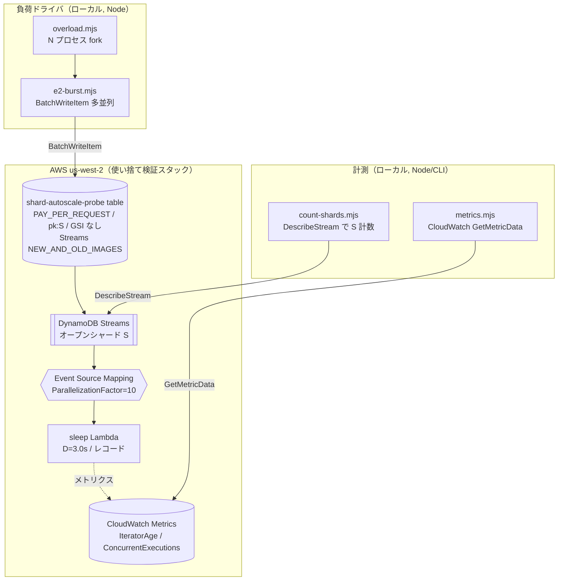
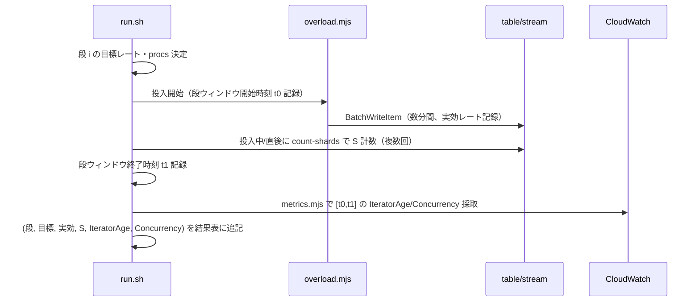

# 設計: シャード自動拡張プローブ（緩やかな漸増での S 成長 + IteratorAge 実測）

## Overview

`requirements.md` で定めた検証を回すための、**使い捨ての最小計測装置**を設計する。
目的は機能提供ではなく「既定オンデマンドテーブル（S=4, warm 4,000）を設定変更なしに緩やかな
書き込み漸増で育てたとき、S が段階的に増えるか・どこまで育つか・各段の IteratorAge はどの程度か」
を実測することである。

設計の中心は 3 つ。

1. **DynamoDB Streams → sleep Lambda（D=3.0s, P=10）** の最小パイプラインを 1 本組む。
2. **4 段の漸増負荷**（2k→4k→8k→16k write/s で打ち切り）を複数プロセス並列で投入する。
   各段は **S 安定ゲート**（S が 3 分変化なしで次段へ・1 段上限 10 分）で進む。Max=40k/S64 は
   既知のため実測せず、途中段のカーブから**外挿で終点を確認**する。
3. 各段で **S（DescribeStream）**・**IteratorAge / ConcurrentExecutions（CloudWatch）**・
   **実効到達レート**を採取し、`(到達ピーク, S, IteratorAge)` のカーブにまとめる。

既存の E1〜E6（`docs/poc/shard-warm-throughput-experiment.md`）と同じ使い捨て方針。
PoC 本体（`amplify/` `src/` `agents/`）には一切触れない。**作成 → 実行 → お片付け**を
README に列挙できる単一の CLI スクリプト一式として実装する。CDK/SAM は使わない。

---

## Architecture

### 1.1 全体構成



### 1.2 設計の要点（式）

```
最大同時実行数 = S × P              （D は入らない）
最大処理能力   = S × P ÷ D          （本検証 D=3.0s 固定, P=10 固定）
各段で滞留するか = 投入実効レート(行/s) >? S×P÷D
```

- P=10 固定なので、各段の処理能力は `S × 10 ÷ 3.0 = S × 3.33 行/s`。
- 例: S=4 → 13.3 行/s しか捌けない。投入が 2,000 write/s なら圧倒的超過 → IteratorAge 急増。
  → **低い段から IteratorAge は顕著に出る見込み**（D=3s を選んだ狙い通り）。
- S が育つほど処理能力が上がる（例 16k 段で S≈26 なら 86 行/s）。それでも投入レートには遠く及ばず、
  **滞留は全段で発生し続ける**のが予測。IteratorAge の「増え方」が S 段で緩和されるかを見る。
- 本検証は終点（S=64, 40k）まで行かない。**低〜中レート 4 段のカーブ**を取り、既知の終点と外挿で突き合わせる。

> 注: 本検証の主眼は「S の成長カーブ」と「各段 IteratorAge の水準」。滞留を解消することではない
> （解消させるには投入を絞る必要があり、それでは S が育たない）。**滞留を許容して S を育てる**。

---

## Components and Interfaces

### 2.1 検証スタック（AWS 側）

| リソース | 設定 | 根拠(要件) |
|---|---|---|
| DynamoDB テーブル | 名 `shard-autoscale-probe`、PAY_PER_REQUEST、`pk`(S) HASH、GSI なし、Streams NEW_AND_OLD_IMAGES | 1.1 |
| sleep Lambda | 名 `shard-autoscale-probe-consumer`、Node.js 20、メモリ 128MB、タイムアウト 60s、処理= `await sleep(3000)` を**レコードごと**に実行 | 1.3 |
| イベントソースマッピング | `ParallelizationFactor=10`、`BatchSize=1`、`MaximumBatchingWindowInSeconds=0`、`StartingPosition=LATEST` | 1.4 / 2.3 |
| IAM ロール | Lambda 実行ロール。最小権限: Stream 読み取り(`GetRecords`/`GetShardIterator`/`DescribeStream`/`ListStreams`) + `AWSLambdaBasicExecutionRole`(ログ) のみ | NFR-セキュリティ |

**sleep Lambda の D の作り方（確定）:** ハンドラは受信バッチの**各レコードごとに 3.0 秒 sleep**。
`BatchSize=1` なので 1 呼び出し = 1 レコード = 3.0 秒。これで「1 レコードの処理時間 D=3.0s」が厳密に出る。
メモリ 128MB で十分（sleep のみ、CPU/メモリ不要）。タイムアウトは余裕をみて 60s。

**なぜ `BatchSize=1`:** D を「1 レコードあたり」で厳密に定義するため。バッチが大きいと
1 呼び出しで複数レコードを処理し D の意味がぶれる。1 に固定して `S×P÷D` の式を素直に保つ。

### 2.2 負荷ドライバ（ローカル, 既存ツール再利用）

E1〜E6 で作った `tmp/shard-probe/` の資産をそのまま使う（新規実装を最小化）。

| スクリプト | 役割 | 変更点 |
|---|---|---|
| `e2-burst.mjs` | 乱数prefix+ULID キーで BatchWriteItem 多並列投入 | テーブル名を引数で差し替えるのみ(既に対応済) |
| `overload.mjs` | `e2-burst` を N プロセス fork し合算レートを稼ぐ | `--procs` を段ごとに変える |
| `count-shards.mjs` | DescribeStream でオープンシャード S を計数(ページング込) | テーブル名差し替えのみ |

> ドライバは `tmp/shard-autoscale-probe/` に集約（git 管理外）。E1〜E6 の `tmp/shard-probe/` とは別ディレクトリ。

### 2.3 計測スクリプト（新規: metrics.mjs）

CloudWatch から段ごとに採取する。

- `GetRecords.IteratorAgeMilliseconds`（Namespace `AWS/Lambda`、FunctionName 次元）: Max / p95(=p95 近似は Maximum と Average で代替可、まず Max と Average) / Average
- `ConcurrentExecutions`（Namespace `AWS/Lambda`、FunctionName 次元）: Maximum
- 取得は `GetMetricData`、period=60s、各段の実行ウィンドウ(開始〜終了時刻)を指定。
- 出力は段・目標レート・実効レート・S・IteratorAge(Max/Avg)・ConcurrentExecutions(Max) を 1 行に。

---

## 実行フロー（create / run / teardown）

### 3.1 スクリプト分割（README で手順明示できる 3 コマンド）

```
tmp/shard-autoscale-probe/
  create.sh      # テーブル+Lambda+IAM+ESM を作成し ACTIVE/有効化まで確認
  run.sh         # 4 段の漸増負荷を順に投入し、各段で S 安定を待って CloudWatch を採取
  teardown.sh    # ESM→Lambda→IAM ロール→テーブル を削除し、残存ゼロを確認
  e2-burst.mjs / overload.mjs / count-shards.mjs / metrics.mjs
```

README には次の 3 ステップだけ載せる（要件 1.7 / 6.3）:

```bash
bash tmp/shard-autoscale-probe/create.sh     # 1. 作成
bash tmp/shard-autoscale-probe/run.sh        # 2. 実行（6段・各段で計測）
bash tmp/shard-autoscale-probe/teardown.sh   # 3. お片付け（課金停止）
```

### 3.2 各段の実行シーケンス（run.sh の 1 段分）



### 3.3 各段の進め方（S 安定ゲート。確定）

時間固定ではなく **S 安定ゲート**で進む。

- 各段で負荷を継続しながら `count-shards` を繰り返し、**オープンシャード数 S が 3 分間変化しない**
  ことをもって「その段の負荷に対する分割が完了した」とみなし、次段へ進む。
- 暴走防止に **1 段あたり最大 10 分**で打ち切る（10 分で安定しなければその時点の S を記録して次へ）。
- 判定は warm 表示値ではなく **S（本来知りたい量）**で行う。
- 段構成は **4 段（2k→4k→8k→16k）で打ち切り**。全体の見込みは各段 3〜10 分で **20〜40 分**。
- 圧縮版の限界（NFR）: 段を上げた直後に「直近ピークの 2 倍超」でスロットリングが混じりうる。
  実効レート低下として記録する。

### 3.4 S と投入ピークの時刻紐づけ（要件 3.5 / 未解決4）

- `run.sh` が各段の `t0`（投入開始）を記録。`count-shards.mjs` は計測ごとに時刻を出力。
- S が前段から増えた段について、その段の `t0` と増加観測時刻の差を記録し、
  「どの投入ピーク更新の後に S が増えたか」を時系列で紐づける。

---

## コストと安全

| 項目 | 見積り/対策 |
|---|---|
| DynamoDB 書き込み(オンデマンド従量) | 4 段（16k 打ち切り）の投入。1KB 項目で WRU 従量。概算 $8〜15。run 前に提示しユーザー判断（要件 5.4） |
| warm 課金 | 負荷で warm が上がる＝不可逆。**teardown でテーブル削除必須**（要件 5.2） |
| Lambda | 128MB × 3s × 実行回数。sleep なので安い。ただし大量レコードを捌くと呼び出し回数は多い |
| 消し忘れ対策 | teardown.sh が ESM→Lambda→IAM→テーブルを順に削除し、`list-*` で残存ゼロを確認（要件 5.1） |

> **運用:** 各段は S 安定（3 分変化なし・上限 10 分）で切り上げ、全体 20〜40 分。終了後ただちに teardown。
> コスト発生操作（run 実行）の前に概算を提示する。

---

## 計測の具体（確定事項）

| 指標 | ソース | 取り方 |
|---|---|---|
| S（オープンシャード） | DynamoDB Streams `DescribeStream` | `count-shards.mjs`、ページング込、各段 2〜3 回計数し安定値を採用 |
| IteratorAge | CloudWatch `AWS/Lambda` `GetRecords.IteratorAgeMilliseconds` | `GetMetricData` period=60s、段ウィンドウで Max と Average |
| 同時実行数 | CloudWatch `AWS/Lambda` `ConcurrentExecutions` | 段ウィンドウで Maximum。`S×P` の理論上限と対比 |
| 実効到達レート | ドライバのログ | `overload.mjs` の合算 wrote/sec |

---

## Testing Strategy

**この装置自体の確からしさを担保する観点。**

- **sanity**: create 直後に `count-shards` が S=4・warm 4,000 を返すこと（要件 1.2）。
- **ESM 有効性**: 少量投入して Lambda が起動し IteratorAge メトリクスが出ることを run 前に確認。
- **分離**: 本検証中に PoC の sandbox テーブル/Lambda に一切アクセスしないこと（名前空間で保証）。
- **teardown 完全性**: teardown 後に `list-tables` / `list-event-source-mappings` /
  `get-function` が当該リソース無しを返すこと（要件 5.1）。

---

## Data Models

本検証は業務データを持たない。DynamoDB 項目は S を育てるためのダミーで、構造は最小。

### 投入アイテム（table `shard-autoscale-probe`）

| 属性 | 型 | 内容 |
|---|---|---|
| `pk` | S（HASH） | `<乱数4byte hex>-<ULID>`。全キースペースに分散しホットパーティションを回避 |
| `payload` | S | 約 1KB の固定ダミー文字列（1 write ≒ 1 WRU に揃える。サイズは S に影響しないと E5改で実証済） |
| `ts` | N | 投入時刻（epoch ms）。デバッグ用途のみ |

> 1 項目 ~1KB に固定する理由: E5改で「項目サイズは S に効かない（1KB でも 64KB でも warm 40,000→S=64）」と
> 実証済みのため、サイズは最小・一定にして write ops と WRU をほぼ 1:1 に保ち、実効レートを読みやすくする。

### 結果レコード（計測出力, ローカル JSON/表）

| フィールド | 内容 |
|---|---|
| `stage` | 段番号 1〜6 |
| `targetRate` | 目標 write/s（2k…40k） |
| `effectiveRate` | 実効到達 write/s（ドライバ合算） |
| `openShards` (S) | 当該段で安定したオープンシャード数 |
| `iteratorAgeMaxMs` / `iteratorAgeAvgMs` | 段ウィンドウの IteratorAge |
| `concurrentExecMax` | 段ウィンドウの ConcurrentExecutions 最大 |
| `t0` / `t1` | 段の投入開始・終了時刻（S 増と投入ピークの紐づけ用） |

## Error Handling

| 事象 | 扱い |
|---|---|
| 投入時の `ProvisionedThroughputExceeded`/スロットリング | BatchWriteItem の UnprocessedItems をリトライ（既存 `e2-burst.mjs` 実装済）。実効レート低下として記録し、エラーで止めない |
| 目標レート未達（投入側頭打ち） | 実効レートを記録して継続。S の上限は実効到達ピークで規定されるため、未達は結果の解釈に反映 |
| Lambda タイムアウト | D=3s に対しタイムアウト 60s で十分な余裕。発生したら ESM 設定ミスとして調査（想定外） |
| CloudWatch メトリクス欠測 | period/ウィンドウを広げて再取得。ESM 起動直後はメトリクス出力に遅延があるため、段の後半で採取 |
| teardown 途中失敗 | 冪等に再実行可能にする（存在しないリソースの削除はスキップ）。最後に `list-*` で残存ゼロを必ず確認 |

## Correctness Properties

この検証装置が「正しく測れている」ための不変条件。

### Property 1: 分離不変
本検証のどの操作も、PoC 本体（sandbox の orders テーブル・order-processor・Amplify）に
読み書きしない。対象リソース名は `shard-autoscale-probe` 接頭辞に限定される。

**Validates: Requirements 1.5**

### Property 2: D 不変
sleep Lambda は 1 レコードあたり厳密に 3.0 秒を消費する（`BatchSize=1` × `sleep(3000)`）。

**Validates: Requirements 1.3, 4.5**

### Property 3: P 不変
全段で ESM の `ParallelizationFactor=10` が維持される。

**Validates: Requirements 1.4, 2.3**

### Property 4: S 計数の網羅性
`count-shards.mjs` は `LastEvaluatedShardId` を追い切り、オープンシャードを取りこぼさない
（1 ページ最大 100 シャードの制約を越えてページングする）。

**Validates: Requirements 3.1, 3.2**

### Property 5: 後片付け完全性
teardown 後、当該テーブル・ESM・Lambda・IAM ロールのいずれもリスト照会で検出されない（課金源ゼロ）。

**Validates: Requirements 5.1, 5.2**

## 既存結論との関係（要件 6.4）

- 本検証が「S は 4→段階的に増え 40k ピークで 64 収束」を示せば、E1 の「warm 40,000→S=64 は決定論的」と
  **到達経路が違っても同じ S=64 に収束**することの傍証になる。
- 「負荷では S は増えない」(E2) と矛盾しない: E2 は warm 40,000 のキャパ**内**だったので分割不要だった。
  本検証は warm 4,000 スタートなので、それを**超える**負荷で分割が誘発される領域を見る。
- 1,000 多重は本検証の対象外（S×P=最大 640、D は無関係）。Streams クォータ引き上げが必要という
  E6 の結論は変わらない。
